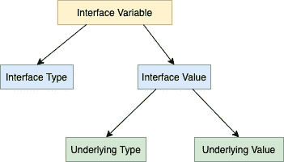
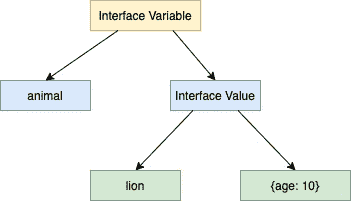

# Go (Golang)中接口的内部工作或内部

> 原文：<https://golangbyexample.com/inner-working-interface-golang/>

# **概述**

像任何其他变量一样，接口变量由类型和值表示。接口值依次由两个元组组成

*   基础类型
*   基础价值

见下图，它说明了我们上面提到的内容

<figure class="wp-block-image size-large"></figure>

让我们看一个例子，然后我们可以为这个例子创建一个类似于上面的图表。

假设我们有一个界面**动物**如下

```go
type animal interface {
    breathe()
    walk()
}
```

我们还有一个**狮子**结构来实现这个**动物**接口

```go
type lion struct {
    age int
}
```

# **代号**

```go
package main

import "fmt"

type animal interface {
    breathe()
    walk()
}

type lion struct {
    age int
}

func (l lion) breathe() {
    fmt.Println("Lion breathes")
}

func (l lion) walk() {
    fmt.Println("Lion walk")
}

func main() {
    var a animal
    a = lion{age: 10}
    a.breathe()
    a.walk()
}
```

**输出**

```go
Lion breathes
Lion walk
```

对于上述情况，实现动物接口的 lion 结构如下所示

<figure class="wp-block-image size-large"></figure>

Golang 提供格式标识符来打印由接口值表示的基础类型和基础值。

*   %T 可用于打印接口值的具体类型

*   %v 可用于打印界面值的具体值。

```go
package main

import "fmt"

type animal interface {
    breathe()
    walk()
}

type lion struct {
    age int
}

func (l lion) breathe() {
    fmt.Println("Lion breathes")
}

func (l lion) walk() {
    fmt.Println("Lion walk")
}

func main() {
    var a animal
    a = lion{age: 10}
    fmt.Printf("Underlying Type: %T\n", a)
    fmt.Printf("Underlying Value: %v\n", a)
}
```

**输出**

```go
Concrete Type: main.lion
Concrete Value: {10}
```