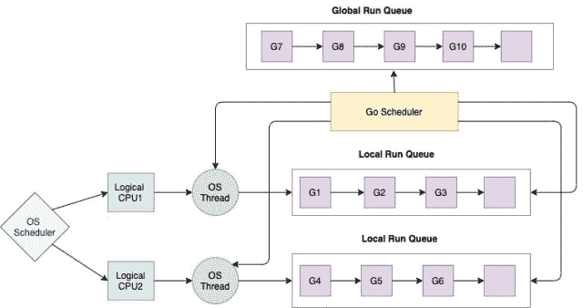

# Goroutines

> 原文：<https://golangbyexample.com/gorroutes-golang/>

这是 golang 综合教程系列的第 23 章。本系列其他章节参考本链接–[格朗综合教程系列](https://golangbyexample.com/golang-comprehensive-tutorial/)

**下一个教程**–[通道](https://golangbyexample.com/channel-golang/)
T5】上一个教程–[Iota](https://golangbyexample.com/iota-in-golang)

现在让我们来看看当前的教程。下面是当前教程的目录。

# **概述**

goro tines 可以被认为是一个轻量级线程，它有一个单独的独立执行，并且可以与其他 goro tines 并发执行。它是一个与其他函数或方法同时执行的函数或方法。它完全由 GO 运行时管理。Golang 是一种并发语言。每一次处决都是独立的。正是 goroutine 帮助 golang 实现了并发性

# **开始一个Goroutines**

Golang 使用一个特殊的关键字**‘go’**来启动 goroutine。要开始一个，只需在函数或方法调用前添加 **go** 关键字。该函数或方法现在将在 goroutine 中执行。请注意，决定它是否是 goroutine 的不是函数或方法。如果我们用 go 关键字调用该方法或函数，那么该函数或方法就被称为在 goroutine 中执行。

让我们理解正常运行函数和作为 goroutine 运行函数之间的区别。

*   正常运行函数

```go
statment1
start()
statement2
```

在正常运行的一个功能为上述场景。

1.  首先，将执行**陈述 1**
2.  然后调用 **start()** 函数
3.  一旦 start()功能完成，将执行**状态 2**

*   作为 goroutine 运行函数

```go
statment1
go start()
statement2
```

在运行上述场景的函数时

1.  首先，陈述 1 将被执行
2.  然后函数 start()将作为 goroutine 被调用，它将异步执行。
3.  **声明 2** 将立即执行。它不会等待 **start()** 功能完成。start 函数将作为 goroutine 同时执行，而程序的其余部分继续执行。

所以基本上，当调用一个函数作为 goro tine 时，调用将立即返回，执行将从下一行继续，而 goro tine 将在后台同时执行。还要注意，goroutine 的任何返回值都将被忽略。

让我们看一个程序来理解上面的观点

```go
package main

import (
    "fmt"
    "time"
)

func main() {
    go start()
    fmt.Println("Started")
    time.Sleep(1 * time.Second)
    fmt.Println("Finished")
}

func start() {
    fmt.Println("In Goroutine")
}
```

**输出**

```go
Started
In Goroutine
Finished
```

在上面的程序中，我们在函数调用之前使用' go '关键字来启动 goroutine。

```go
go start()
```

上一行将启动一个 goroutine，运行 **start()** 功能。程序首先打印“开始”。请注意，我们打印“已开始”的那一行是在 goroutine 开始之后。这说明了上面提到的一点，即在一个 goroutine 开始后，呼叫从下一行继续。然后我们暂停。超时是存在的，这样 goro tine 就可以在主 goro tine 存在之前被调度。所以现在 goroutine 执行并打印

```go
In Goroutine
```

然后打印出来

```go
Finished
```

当我们取消超时时会发生什么。让我们看一个程序。

```go
package main
import (
    "fmt"
)
func main() {
    go start()
    fmt.Println("Started")
    fmt.Println("Finished")
}
func start() {
    fmt.Println("In Goroutine")
}
```

**输出**

```go
Started
Finished
```

上面的程序从不打印

```go
In Goroutine
```

这意味着戈罗廷人从未被处决。这是因为主 goro tine 或程序在 goro tine 可以被调度之前退出。这引发了关于主要食物的讨论

# **主干线**

**主**包中的**主**功能是主 goroutine。所有 goroutine 都是从主 goroutine 开始的。这些 goroutine 然后可以启动多个其他 goroutine，以此类推。

主 goroutine 代表主程序。一旦退出，就意味着程序已经退出。

Goroutines 没有父母和孩子。当您启动一个 goroutine 时，它会与所有其他正在运行的 go routine 一起执行。每个 goroutine 只有在其函数返回时才会退出。唯一的例外是，当主 goroutine(运行函数 **main** 的那个)退出时，所有 goroutine 都退出。

让我们看一个程序来证明 goroutines 没有父母和孩子。

```go
package main

import (
    "fmt"
    "time"
)

func main() {
    go start()
    fmt.Println("Started")
    time.Sleep(1 * time.Second)
    fmt.Println("Finished")
}

func start() {
    go start2()
    fmt.Println("In Goroutine")
}
func start2() {
    fmt.Println("In Goroutine2")
}
```

**输出**

```go
Started
In Goroutine
In Goroutine2
Finished
```

在上面的程序中，第一个 goro tine 启动第二个 goro tine。然后第一个 goro tine 打印**“在 goro tine 中”**，然后退出。第二个 goroutine 开始打印**“在 goro tine 2”**。它表明 goroutines 没有父母或孩子，它们作为一个独立的执行机构存在。

此外，请注意超时只是为了说明，绝不应该在生产环境中使用。

# **创建多个戈罗提**

让我们看看下面启动多个 goroutines 的程序。这个例子还将演示 goroutines 是同时执行的

```go
package main

import (
    "fmt"
    "time"
)

func execute(id int) {
    fmt.Printf("id: %d\n", id)
}

func main() {
    fmt.Println("Started")
    for i := 0; i < 10; i++ {
        go execute(i)
    }
    time.Sleep(time.Second * 2)
    fmt.Println("Finished")
}
```

**输出**

```go
Started
id: 4
id: 9
id: 1
id: 0
id: 8
id: 2
id: 6
id: 3
id: 7
id: 5
Finished
```

上面的程序将在一个循环中产生 10 个 goroutines。每次运行程序时，它都会给出不同的输出，因为 goroutines 会同时运行，哪个先运行并不确定。

让我们了解 go 调度器的工作原理。在那之后理解 goroutines 会容易得多。

# **戈罗廷的调度**

go 程序启动后，go runtime 将启动与当前进程可用的逻辑 CPU 数量相等的 OS 线程。每个虚拟核心有一个逻辑 CPU，其中虚拟核心意味着

```go
virtual_cores = x*number_of_physical_cores
```

其中 x =每个内核的硬件线程数

**运行时。Numcpus** 功能可用于获取 GO 程序可用的逻辑处理器数量。见下面的程序

```go
package main
import (
    "fmt"
    "runtime"
)
func main() {
    fmt.Println(runtime.NumCPU())
}
```

在我的机器上它能打印 16 个。我的机器有 8 个物理内核，每个内核有 2 个硬件线程。因此 2*8 = 16。

go 程序将启动与它可用的逻辑 CPU 数量或运行时输出相等的操作系统线程。NumCPU()。这些线程将由操作系统管理，将这些线程调度到中央处理器内核上仅由操作系统负责。

go 运行时有自己的调度程序，它将在 go 运行时多路复用操作系统级线程上的灌浆。所以基本上每个 goroutine 都运行在一个分配给逻辑 CPU 的操作系统线程上

管理 goroutines 和将其分配给操作系统线程涉及两个队列

## **本地运行队列**

在 go runtime 中，每个操作系统线程都有一个与之关联的队列。它被称为本地运行队列。它包含将在该线程的上下文中执行的所有 goroutines。go 运行时会将属于特定 LRQ 的 goroutines 调度和上下文切换到拥有该 LRQ 的相应操作系统级线程

## **全局运行队列**

它包含所有没有被移动到任何操作系统线程的任何 LRQ 的 goroutines。开始调度程序将从这个队列中分配一个队列到任何操作系统线程的本地运行队列

下图描述了调度程序是如何工作的。

<figure class="wp-block-image size-large"></figure>

# **格朗调度器是一个协同调度器**

go 调度程序是一个协作调度程序。意味着这是非先发制人的。没有基于时间的抢占正在发生，这是抢占调度器的情况。在协作调度器中，线程必须显式地让出执行。有一些特定的检查点，goro tine 可以将其执行交给其他 goro tine。

运行时根据函数调用调用调度程序，以决定是否需要调度新的 goroutine。所以基本上，当一个 goro tine 进行任何函数调用时，在这种情况下，scheduler 将被调用，上下文切换可能发生，这意味着一个新的 goro tine 可能被调度。现有的 goroutine 也有可能继续执行。调度程序也有机会在事件下面打开上下文

1.  函数调用
2.  碎片帐集
3.  网络电话
4.  通道运营
5.  使用 go 关键字时
6.  阻塞互斥等原语

值得一提的是，调度程序在上述事件中运行，但这并不意味着会发生上下文切换。只是调度程序得到了机会。调度程序决定是否进行上下文切换。

# **goro tines 相对于线程的优势**

*   Goroutines 的大小从 8kb 开始，它的大小可以根据运行时需求而增长或缩小。而操作系统线程的大小超过 1 mb。所以 goroutines 的分配非常便宜。因此，大量的 goroutines 可以一次发射。goroutine 的收缩和增长由 go 运行时内部管理。由于 go routines 很便宜，你可以启动几十万个 go 例程，而你只能启动几千个线程。

*   Goroutine 调度由 go runtime 执行。如上所述，go 运行时在内部启动的 os 线程数量相当于逻辑 CPU 的数量。然后，它将 goroutines 重新安排到每个操作系统线程上。所以 goroutines 的调度是由 go 运行时完成的，因此它非常快。在线程的情况下，线程的调度是由操作系统运行时完成的。因此，goroutines 的上下文切换时间比线程的上下文切换时间快得多。因此，数千个 goroutines 在一个或两个操作系统线程上被多路复用。如果你在 JAVA 中启动 1000 个线程，那么它将消耗大量的资源，这 1000 个线程需要由操作系统来管理。此外，每个线程的大小都将超过 1 MB

*   Goroutines 通过内置的 primivate 通道进行通信，该通道用于处理比赛条件。因此 go 例程之间的通信是安全的，可以防止显式锁定。所以 goroutines 之间共享的数据结构不必被锁定。线程编程使用锁来访问共享变量。这些可能导致难以检测的死锁和竞争情况。相比之下，goroutines 使用通道进行通信，整个同步由 go runtime 管理。这样就避免了死锁和竞争情况。事实上，Golang相信咒语

```go
"Don't share memory for communication, instead share memory by communicating"
```

# **匿名戈罗提内斯**

golang 中的匿名函数也可以使用 goroutine 调用。关于匿名函数的更多了解请参考本文-[https://golangbyexample.com/go-anonymous-function/](https://golangbyexample.com/go-anonymous-function/)

下面是在 goroutine 中调用匿名函数的格式

```go
go func(){
   //body
}(args..)
```

虽然在使用 goro tine 调用匿名函数或使用 goro tine 调用普通函数时，行为没有区别

让我们看一个例子:

```go
package main

import (
    "fmt"
    "time"
)

func main() {
    go func() {
        fmt.Println("In Goroutine")
    }()

    fmt.Println("Started")
    time.Sleep(1 * time.Second)
    fmt.Println("Finished")
}
```

**输出**

```go
Started
In Goroutine
Finished
```

# **结论**

这一切都是为了Golang的戈罗廷。希望你喜欢这个教程。请在评论中分享反馈/改进/错误

**下一个教程**–[通道](https://golangbyexample.com/channel-golang/)
T5】上一个教程–[Iota](https://golangbyexample.com/iota-in-golang)