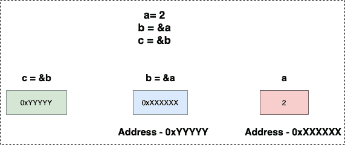

# 指向指针的指针

> 原文：<https://golangbyexample.com/pointer-to-pointer-golang>

# **概述**

也可以创建一个指向 go 中指针的指针

```go
a := 2
b := &a
c := &b
```

`c` 在这里是指针对指针。它存储了 `b` 的地址，该地址又存储了 `a` 的地址。使用 ***** 操作符的双重解引用可用于打印指针对指针的值。因此 **`c` 将打印数值 2

下图描述了

*   `b` 包含 `a` 的地址

*   `c` 包含 `b` 的地址



# **程序**

让我们看一个描述指针对指针的程序

```go
package main

import "fmt"

func main() {
	a := 2
	b := &a
	c := &b

	fmt.Printf("a: %d\n", a)
	fmt.Printf("b: %x\n", b)
	fmt.Printf("c: %x\n", c)

	fmt.Println()
	fmt.Printf("a: %d\n", a)
	fmt.Printf("*&a: %d\n", *&a)
	fmt.Printf("*b: %d\n", *b)
	fmt.Printf("**c: %d\n", **c)

	fmt.Println()
	fmt.Printf("&a: %d\n", &a)
	fmt.Printf("b: %d\n", b)
	fmt.Printf("&*b: %d\n", &*b)
	fmt.Printf("*&b: %d\n", *b)
	fmt.Printf("*c: %d\n", *c)

	fmt.Println()
	fmt.Printf("b: %d\n", &b)
	fmt.Printf("*c: %d\n", c)
}
```

**输出**

```go
a: 2
b: c000018078
c: c00000e028

a: 2
*&a: 2
*b: 2
**c: 2

&a: 824633819256
b: 824633819256
&*b: 824633819256
*&b: 824633819256
*c: 824633819256

b: 824633778216
*c: 824633778216
```

从输出可以清楚地看出

下面的值相当于变量 `a` 的值，即 2

*   a
*   *&a
*   *b
*   **c

下面的**相当于变量 `b` 的值，该变量是 `a` 的地址**

 ***   &a
*   b
*   &*b
*   *&b
*   *c

下面的 ****相当于变量 `c` 的值，该变量是 `b` 的地址****

 *****   b
*   *c******