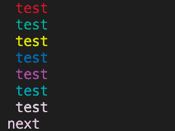

# 在控制台中打印/输出彩色文本

> 原文：<https://golangbyexample.com/print-output-text-color-console>

**注意:**如果你有兴趣学习 golang，那么为此我们有一个 Golang 综合教程系列。一定要看看–[格朗综合教程系列](https://golangbyexample.com/golang-comprehensive-tutorial/)。现在让我们看看当前的教程。下面是目录。

# **概述**

[ANSI 转义码](http://en.wikipedia.org/wiki/ANSI_escape_code)可用于在控制台输出彩色文本。请注意

*   在 MAC/Linux 系统中，终端支持 ANSI 转义码

*   Windows 命令提示符不支持它。在 windows 上，您可以安装 Cygwin。ANSI 转义码可以解决这个问题。

另外要提到的是，在下面的代码中，我们已经在打印后使用了颜色重置。如果我们不使用它，那么颜色效果会保留，并且不会被清除。从下面的代码中删除颜色重置，它会以青色显示文本“**”下一个“**”
下面是 golang 中的代码来做同样的事情。

# **代号**

```go
package main

import (
    "fmt"
)

func main() {
    colorReset := "\033[0m"

    colorRed := "\033[31m"
    colorGreen := "\033[32m"
    colorYellow := "\033[33m"
    colorBlue := "\033[34m"
    colorPurple := "\033[35m"
    colorCyan := "\033[36m"
    colorWhite := "\033[37m"

    fmt.Println(string(colorRed), "test")
    fmt.Println(string(colorGreen), "test")
    fmt.Println(string(colorYellow), "test")
    fmt.Println(string(colorBlue), "test")
    fmt.Println(string(colorPurple), "test")
    fmt.Println(string(colorWhite), "test")
    fmt.Println(string(colorCyan), "test", string(colorReset))
    fmt.Println("next")
}
```

**输出:**

在我的 mac 电脑上

