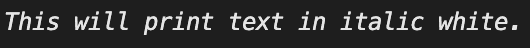

# 在 Golang中以斜体打印/输出文本

> 原文：<https://golangbyexample.com/print-italic-text-golang/>

# **概述**

我们可以用信仰包来达到同样的目的

[https://github . com/Fatih/color](https://github.com/fatih/color)

# **程序**

```go
package main

import (
	"fmt"

	"github.com/fatih/color"
)

func main() {
	whilte := color.New(color.FgWhite)
	boldWhite := whilte.Add(color.Italic)
	boldWhite.Println("This will print text in italic white.")
}
```

**输出**

<figure class="wp-block-image size-full"></figure>