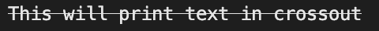

# 在 Go (Golang)中打印/输出划掉的文本

> 原文：<https://golangbyexample.com/print-text-crossout-golang/>

# **概述**

我们可以用信仰包来达到同样的目的

[https://github . com/Fatih/color](https://github.com/fatih/color)

# **程序**

```go
package main

import (
	"github.com/fatih/color"
)

func main() {
	whilte := color.New(color.FgWhite)
	boldWhite := whilte.Add(color.CrossedOut)
	boldWhite.Println("This will print text in crossout")
}
```

**输出**

<figure class="wp-block-image size-full"></figure>

**注意:**查看我们的 Golang 高级教程。本系列中的教程是详尽的，我们试图用例子来涵盖所有的概念。本教程面向希望获得专业知识并对高朗有扎实了解的人–[高朗进阶教程](https://golangbyexample.com/golang-comprehensive-tutorial/)

如果你有兴趣了解如何在 Golang 中实现所有的设计模式。如果是，那么这个帖子是给你的–[所有设计模式 Golang](https://golangbyexample.com/all-design-patterns-golang/)