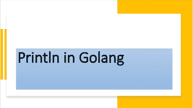

# 理解`Println()`函数

> 原文：<https://golangbyexample.com/println-golang/>



## **概述**

**Println** 在 **fmt** 包中定义，用于格式化字符串并写入标准输出

[https://golang . org/pkg/fmt/# println](https://golang.org/pkg/fmt/#Println)

下面是 **Println** 的功能原型

```go
func Println(a ...interface{}) (n int, err error)
```

**Println** 使用默认格式说明符格式化字符串，并在字符串后添加新行。 **Println** 接受可变数量的参数，其中每个参数都是一个空接口。它返回打印的字符数和任何错误(如果发生)。因为参数类型是一个空接口，所以我们可以向它传递任何数据类型。我们可以传递字符串、int、float、struct 或任何其他数据类型。 **Println** 函数的每个参数都是根据该参数类型的默认格式说明符格式化的。例如，该结构将根据下面的说明符进行格式化

```go
%v
```

此格式说明符仅打印结构中的值部分。让我们看一个例子

## **程序**

```go
package main
import "fmt"
type employee struct {
    Name string
    Age  int
}
func main() {
    name := "John"
    age := 21
    fmt.Println("Name is: ", name)
    fmt.Println("Age is: ", age)
    e := employee{
        Name: name,
        Age:  age,
    }
    fmt.Println(e)
    fmt.Println("a", 12, "b", 12.0)

    bytesPrinted, err := fmt.Println("Name is: ", name)
    if err != nil {
	log.Fatalln("Error occured", err)
    }
    fmt.Println(bytesPrinted)
}
```

**输出**

```go
Name is: John
Age is: 21
{John 21}
a 12 b 12
Name is: John
14
```

关于 **Println** 功能需要注意的几个要点

*   它在末尾追加一个换行符。这就是为什么每个输出都在不同的线上

*   输出中的每个参数将由空格分隔。这就是原因

```go
fmt.Println("Name is: ", name)
```

印刷品

```go
Name is: John
```

两个参数之间会自动引入空格。

*   它返回打印的字符数或任何错误(如果发生)

```go
bytesPrinted, err := fmt.Println("Name is: ", name)
if err != nil {
    log.Fatalln("Error occured", err)
}
fmt.Println(bytesPrinted)
```

将在下面输出

```go
Name is: John
14
```

输出 14 个字符时，打印的字节数为 14

另外，请查看我们的 Golang 进阶教程系列–[Golang 进阶教程](https://golangbyexample.com/golang-comprehensive-tutorial/)