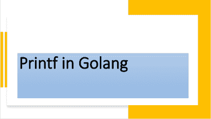

# 理解`Printf()`函数

> 原文：<https://golangbyexample.com/printf-golang/>



## **概述**

`Printf`在`fmt`包中定义，用于格式化字符串并写入标准输出

[https://golang . org/pkg/fmt/# printf](https://golang.org/pkg/fmt/#Printf)

下面是`Printf`的功能原型

```go
func Printf(format string, a ...interface{}) (n int, err error)
```

`Printf`使用自定义说明符格式化字符串。它也没有添加新行。`Printf`也是一个变量函数，意思是它可以有多个参数。关于它的论点列表，有两点很重要

*   请注意，第一个参数是一个**格式的**或**模板**字符串。

*   接下来是可变数量的参数。该列表中的每个参数可以是字符串、int、struct 或任何其他形式。这就是为什么它是一个空的接口

**格式**或**模板**字符串包含需要格式化的实际字符串加上一些格式化动词。这些格式动词告诉我们最后一个字符串中的尾随参数的格式。所以基本上，格式字符串参数包含某些符号，这些符号被尾随参数替换。

邪恶的笑（Evil Grin 的缩写）

**打印字符串变量**

*   **%s** 符号被使用

*   例子

```go
name := "John"
fmt.Printf("Name is: %s\n", name)
```

**打印整数**

*   **%d** 符号被使用

*   例子

```go
age := 21
fmt.Printf("Age is: %d\n", age)
```

**打印结构**

例如，有三种格式说明符用于打印结构。

*   **% v**–它将只打印值。不会打印字段名。这是使用 Println 时打印结构的默认方式

*   **%+v–**将同时打印字段和值。

*   **% # v–**它将打印结构，以及字段名和值

这就是原因

```go
fmt.Printf("Employee is %v\n", e)
fmt.Printf("Employee is %+v\n", e)
fmt.Printf("Employee is %#v\n", e)
```

分别打印在下面

```go
Employee is {John 21}
Employee is {Name:John Age:21}
Employee is main.employee{Name:"John", Age:21}
```

根据上面的解释。

此外，请注意，此函数返回打印的字符数和任何错误(如果发生)。与`Println`不同，它确实增加了一个新行。您必须明确添加**\ n**。

## 程序

这是同样的工作程序

```go
package main

import (
	"fmt"
	"log"
)

type employee struct {
	Name string
	Age  int
}

func main() {
	name := "John"
	age := 21

	fmt.Printf("Name is: %s\n", name)
	fmt.Printf("Age is: %d\n", age)

	fmt.Printf("Name: %s Age: %d\n", name, age)

	e := employee{
		Name: name,
		Age:  age,
	}

	fmt.Printf("Employee is %v\n", e)
	fmt.Printf("Employee is %+v\n", e)
	fmt.Printf("Employee is %#v\n", e)

	bytesPrinted, err := fmt.Printf("Name is: %s\n", name)
	if err != nil {
		log.Fatalln("Error occured", err)
	}
	fmt.Println(bytesPrinted)
}
```

**输出**

```go
Name is: John
Age is: 21
Name: John Age: 21
Employee is {John 21}
Employee is {Name:John Age:21}
Employee is main.employee{Name:"John", Age:21}
Name is: John
14
```

请注意，在下面的**打印**

```go
fmt.Printf("Name: %s Age: %d\n", name, age)
```

*   **%s** 替换为名称。

*   **%d** 被年龄代替。

所以基本上，格式字符串参数中的符号或动词按顺序被尾随参数替换

如果格式字符串中格式说明符的数量与下一个变量参数的数量不匹配，则格式说明符将按原样打印。例如，在下面的代码中，我们有两个格式说明符

*   %d

*   %s

而下一个变量的参数数量只有一个。因此，当我们打印它时，它将打印第二个格式说明符，作为一个警告

```go
package main
import "fmt"
type employee struct {
    Name string
    Age  int
}
func main() {
    name := "John"
    fmt.Printf("Name is: %s %d\n", name)
}
```

**输出**

```go
Name is: John %!d(MISSING)
```

另外，请查看我们的 Golang 进阶教程系列–[Golang 进阶教程](https://golangbyexample.com/golang-comprehensive-tutorial/)