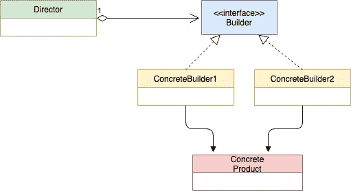

# 构建器模式

> 原文：<https://golangbyexample.com/builder-pattern-golang/>

# **定义**：

构建器模式是一种用于构建复杂对象的创造性设计模式。下面是 UML 图。

注意:有兴趣了解如何在 GO 中实现所有其他设计模式。请参阅此完整参考资料–[Golang](https://golangbyexample.com/all-design-patterns-golang/)中的所有设计模式

# **UML 图**


*   


# **映射(也参考第 5 点–示例)**


| 导演 | 导演，走 |
| 生成器接口 | 伊布图，走 |
| 混凝土施工员 1 | 正常生成器。go |
| 混凝土施工员 2 | iglooBuilder，走 |
| 产品 | 豪斯走吧 |


# **何时使用**

*   当构建的对象很大并且需要多个步骤时，使用构建器模式。它有助于减少构造函数的大小。房子的建造变得简单，不需要大的建筑商

*   当需要创建同一产品的不同版本时。例如，在下面的代码中，我们看到了不同版本的 house ie。冰屋和由**冰屋建筑商**和**普通建筑商**建造的普通房屋

*   当半构造的最终对象不应该存在时。再次参考下面的代码，所创建的房屋将要么完全创建，要么根本不创建。混凝土构建器结构保存正在创建的房屋对象的临时状态

# **例**：

**布告栏。去**

```go
package main

type iBuilder interface {
    setWindowType()
    setDoorType()
    setNumFloor()
    getHouse() house
}

func getBuilder(builderType string) iBuilder {
    if builderType == "normal" {
        return &normalBuilder{}
    }
    if builderType == "igloo" {
        return &iglooBuilder{}
    }
    return nil
}
```

**正常生成器。go**

```go
package main

type normalBuilder struct {
    windowType string
    doorType   string
    floor      int
}

func newNormalBuilder() *normalBuilder {
    return &normalBuilder{}
}

func (b *normalBuilder) setWindowType() {
    b.windowType = "Wooden Window"
}

func (b *normalBuilder) setDoorType() {
    b.doorType = "Wooden Door"
}

func (b *normalBuilder) setNumFloor() {
    b.floor = 2
}

func (b *normalBuilder) getHouse() house {
    return house{
        doorType:   b.doorType,
        windowType: b.windowType,
        floor:      b.floor,
    }
}
```

`iglooBuilder.go`

```go
package main

type iglooBuilder struct {
    windowType string
    doorType   string
    floor      int
}

func newIglooBuilder() *iglooBuilder {
    return &iglooBuilder{}
}

func (b *iglooBuilder) setWindowType() {
    b.windowType = "Snow Window"
}

func (b *iglooBuilder) setDoorType() {
    b.doorType = "Snow Door"
}

func (b *iglooBuilder) setNumFloor() {
    b.floor = 1
}

func (b *iglooBuilder) getHouse() house {
    return house{
        doorType:   b.doorType,
        windowType: b.windowType,
        floor:      b.floor,
    }
}
```

**过家家**

```go
package main

type house struct {
    windowType string
    doorType   string
    floor      int
}
```

**总监 go**

```go
package main

type director struct {
    builder iBuilder
}

func newDirector(b iBuilder) *director {
    return &director{
        builder: b,
    }
}

func (d *director) setBuilder(b iBuilder) {
    d.builder = b
}

func (d *director) buildHouse() house {
    d.builder.setDoorType()
    d.builder.setWindowType()
    d.builder.setNumFloor()
    return d.builder.getHouse()
}
```

`main.go`

```go
package main

import "fmt"

func main() {
    normalBuilder := getBuilder("normal")
    iglooBuilder := getBuilder("igloo")

    director := newDirector(normalBuilder)
    normalHouse := director.buildHouse()

    fmt.Printf("Normal House Door Type: %s\n", normalHouse.doorType)
    fmt.Printf("Normal House Window Type: %s\n", normalHouse.windowType)
    fmt.Printf("Normal House Num Floor: %d\n", normalHouse.floor)

    director.setBuilder(iglooBuilder)
    iglooHouse := director.buildHouse()

    fmt.Printf("\nIgloo House Door Type: %s\n", iglooHouse.doorType)
    fmt.Printf("Igloo House Window Type: %s\n", iglooHouse.windowType)
    fmt.Printf("Igloo House Num Floor: %d\n", iglooHouse.floor)
}
```

**输出**：

```go
Normal House Door Type: Wooden Door
Normal House Window Type: Wooden Window
Normal House Num Floor: 2

Igloo House Door Type: Snow Door
Igloo House Window Type: Snow Window
Igloo House Num Floor: 1
```