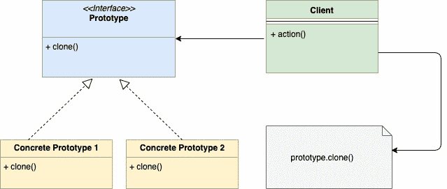

# 围棋中的原型模式

> 原文：<https://golangbyexample.com/prototype-pattern-go/>

注意:有兴趣了解如何在 GO 中实现所有其他设计模式。请参阅此完整参考资料–[Go(Golang)](https://golangbyexample.com/all-design-patterns-golang/)中的所有设计模式

## **定义:**

这是一种创造性的设计模式，允许您创建对象的副本。在这种模式下，创建克隆对象的责任被委托给要克隆的实际对象。

要克隆的对象公开了一个克隆方法，该方法返回对象的克隆副本

## **何时使用**

*   当要克隆的对象创建过程复杂时，我们使用原型模式，即克隆可能涉及处理深层副本、层次副本等。此外，可能还有一些不能直接访问的私有成员。
*   创建对象的副本，而不是从头开始创建新实例。这防止了创建新对象时涉及的昂贵操作，如数据库操作。
*   当您想要创建一个新对象的副本，但它仅作为一个界面提供给您时。因此，您不能直接创建该对象的副本。

## **UML 图**

<figure class="wp-block-image"></figure>

## **映射**

下表显示了从 UML 图参与者到代码中实际实现参与者的映射。

<figure class="wp-block-table is-style-stripes">

| 原型界面 | 伊诺德，走 |
| 混凝土原型 1 | 文件。开始 |
| 混凝土原型 2 | 文件夹。开始 |
| 客户 | main.go |

</figure>

## **实例** :

在 golang 的上下文中，让我们试着用 os 文件系统的例子来理解它。操作系统文件系统有文件和文件夹，文件夹本身包含文件和文件夹。每个**文件**和**文件夹**可以用一个**索引节点**界面来表示。 **inode** 界面也有**克隆**()功能。

inode . go

```go
package main

type inode interface {
    print(string)
    clone() inode
}
```

**文件**结构表示为

**文件转到**

```go
package main

import "fmt"

type file struct {
	name string
}

func (f *file) print(indentation string) {
	fmt.Println(indentation + f.name)
}

func (f *file) clone() inode {
	return &file{name: f.name + "_clone"}
} 
```

**文件夹**结构表示为

**文件夹. go**

```go
package main

import "fmt"

type folder struct {
	childrens []inode
	name      string
}

func (f *folder) print(indentation string) {
	fmt.Println(indentation + f.name)
	for _, i := range f.childrens {
		i.print(indentation + indentation)
	}
}

func (f *folder) clone() inode {
	cloneFolder := &folder{name: f.name + "_clone"}
	var tempChildrens []inode
	for _, i := range f.childrens {
		copy := i.clone()
		tempChildrens = append(tempChildrens, copy)
	}
	cloneFolder.childrens = tempChildrens
	return cloneFolder
} 
```

由于**文件**和**文件夹**结构都实现了**打印**和**克隆**功能，因此它们属于**索引节点**类型。另外，请注意文件和文件夹中的**克隆**功能。两者中的**克隆**函数返回各自文件或文件夹的副本。克隆时，我们在名称字段中添加关键字“_clone”。让我们编写主要函数来测试一下。

**main.go**

```go
package main

import "fmt"

func main() {
    file1 := &file{name: "File1"}
    file2 := &file{name: "File2"}
    file3 := &file{name: "File3"}
    folder1 := &folder{
        childrens: []inode{file1},
        name:      "Folder1",
    }
    folder2 := &folder{
        childrens: []inode{folder1, file2, file3},
        name:      "Folder2",
    }
    fmt.Println("\nPrinting hierarchy for Folder2")
    folder2.print("  ")
    cloneFolder := folder2.clone()
    fmt.Println("\nPrinting hierarchy for clone Folder")
    cloneFolder.print("  ")
}
```

**输出:**

```go
Printing hierarchy for Folder2
  Folder2
    Folder1
        File1
    File2
    File3

Printing hierarchy for clone Folder
  Folder2_clone
    Folder1_clone
        File1_clone
    File2_clone
    File3_clone
```