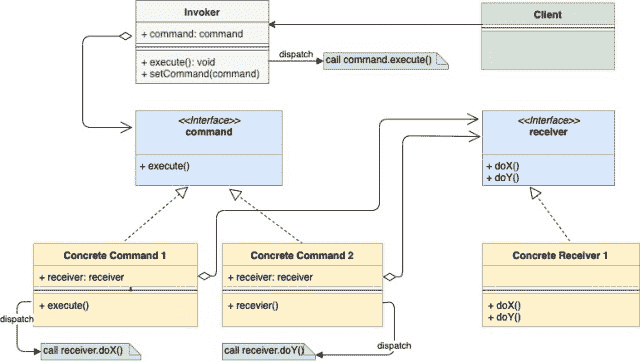

# 命令设计模式

> 原文：<https://golangbyexample.com/command-design-pattern-in-golang/>

注意:有兴趣了解如何在 GO 中实现所有其他设计模式。请参见此完整参考资料–[https://golangbyexample.com/all-design-patterns-golang/](https://golangbyexample.com/all-design-patterns-golang/https://golangbyexample.com/all-design-patterns-golan)

## **简介:**

命令设计模式是一种行为设计模式。它建议将请求封装为一个独立的对象。创建的对象拥有关于请求的所有信息，因此可以独立执行它。

命令设计模式中使用的基本组件有:

*   **接收器**–它是包含业务逻辑的类。命令对象只延迟它对接收器的请求。
*   **命令**–嵌入接收器并绑定接收器的特定动作。
*   **Invoker**–它嵌入命令，并通过调用命令的执行方法来封装命令。
*   **客户端**–它用适当的接收器创建命令，绕过接收器到达命令的构造器。之后，它还将结果命令与调用者相关联。

让我们了解一种情况，在这种情况下，我们将清楚为什么命令模式是有用的。想象一下电视的情况。电视可以通过以下任一方式打开

 **1.  远程开启按钮
2.  打开电视上的按钮。

这两个触发点做同样的事情，即打开电视。为了打开电视，我们可以用接收器作为电视来实现打开命令对象。当在这个 on 命令对象上调用 execute()方法时，它又调用 TV.on()函数。所以在这种情况下:

*   **接收器**是**电视**
*   **命令**是嵌入**电视**的 **ON 命令对象**
*   **调用者**是电视上的**遥控开启按钮**或**开启按钮。两者都嵌入**开命令对象****

请注意，我们已经将打开**电视**的请求包装成了一个**打开命令对象**，可以被多个调用程序调用。这个 ON 命令对象嵌入了接收器(这里是电视)，可以独立执行。

作为另一个例子，想象一下一个 **Adobe Photoshop** 应用的情况。在 Photoshop 中，可以从三个地方触发保存操作

1.  从菜单上。
2.  从上方的按钮。
3.  使用快捷键 Ctrl+S。

所有三个触发点都做同样的事情，即在应用中保存当前图像。这种保存可以包装到保存命令对象中，并在应用中打开当前图像作为接收器。

在上面的例子中创建一个单独的命令对象有什么好处。

1.  它将用户接口逻辑从底层业务逻辑中分离出来
2.  不需要为每个调用程序创建不同的处理程序。
3.  命令对象包含它需要执行的所有信息。因此，它也可以用于延迟执行。

现在让我们看看 UML 图。

## **UML 图:**

*   注意 Invoker 是如何嵌入命令的。请求被发送到调用者，调用者将请求传递给封装的命令对象。
*   所有的具体命令对象都嵌入了接收器


*   


## **映射**

下表表示**【实例】
下面的**中从 UML 图参与者到实际实现参与者的映射


| 调用程序 | 按钮，开始 |
| 命令接口 | 命令，开始 |
| 混凝土指挥部 1 | onccommand . go .去吧 |
| 混凝土指挥部 2 | 长官，走吧 |
| 接收器接口 | 设备。开始 |
| 混凝土接收器 | 电视。开始 |
| 客户 | main.go |


## **实例:**

**按钮，开始**

```go
package main

type button struct {
    command command
}

func (b *button) press() {
    b.command.execute()
}
```

**命令开始**

```go
package main

type command interface {
    execute()
}
```

**onccommand . go**

```go
package main

type onCommand struct {
    device device
}

func (c *onCommand) execute() {
    c.device.on()
}
```

**提供命令。go**

```go
package main

type offCommand struct {
    device device
}

func (c *offCommand) execute() {
    c.device.off()
}
```

**装置开始**

```go
package main

type device interface {
    on()
    off()
}
```

电视。去

```go
package main

import "fmt"

type tv struct {
    isRunning bool
}

func (t *tv) on() {
    t.isRunning = true
    fmt.Println("Turning tv on")
}

func (t *tv) off() {
    t.isRunning = false
    fmt.Println("Turning tv off")
}
```

**main.go**

```go
package main

func main() {
    tv := &tv{}
    onCommand := &onCommand{
        device: tv,
    }
    offCommand := &offCommand{
        device: tv,
    }
    onButton := &button{
        command: onCommand,
    }
    onButton.press()
    offButton := &button{
        command: offCommand,
    }
    offButton.press()
}
```

**输出:**

```go
Turning tv on
Turning tv off
```

## **完整工作代码:**

```go
package main

import "fmt"

type button struct {
    command command
}

func (b *button) press() {
    b.command.execute()
}

type command interface {
    execute()
}

type offCommand struct {
    device device
}

func (c *offCommand) execute() {
    c.device.off()
}

type onCommand struct {
    device device
}

func (c *onCommand) execute() {
    c.device.on()
}

type device interface {
    on()
    off()
}

type tv struct {
    isRunning bool
}

func (t *tv) on() {
    t.isRunning = true
    fmt.Println("Turning tv on")
}

func (t *tv) off() {
    t.isRunning = false
    fmt.Println("Turning tv off")
}

func main() {
    tv := &tv{}
    onCommand := &onCommand{
        device: tv,
    }
    offCommand := &offCommand{
        device: tv,
    }
    onButton := &button{
        command: onCommand,
    }
    onButton.press()
    offButton := &button{
        command: offCommand,
    }
    offButton.press()
}
```

**输出:**

```go
Turning tv on
Turning tv off
```**