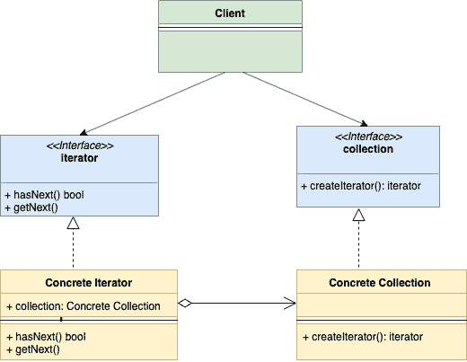

# 迭代器设计模式

> 原文：<https://golangbyexample.com/go-iterator-design-pattern/>

注意:有兴趣了解如何在 GO 中实现所有其他设计模式。请参阅此完整参考资料–[Golang](https://golangbyexample.com/all-design-patterns-golang/)中的所有设计模式

# **简介**：

迭代器设计模式是一种行为设计模式。在这种模式中，集合结构提供了一个迭代器，允许它按顺序遍历集合结构中的每个元素，而不暴露其底层实现。
下面是迭代器设计模式的基本组件

*   **迭代器** **接口**:该接口提供了**hasNext()****getNext()**等基本操作。顾名思义，这些操作允许您遍历集合、重新开始迭代等

*   **集合接口**:该接口表示需要遍历的集合。这个接口定义了一个方法**创建迭代器()**，返回**迭代器**类型

*   **具体迭代器**：迭代器接口的具体实现

*   **具体采集**:采集接口的具体实现

这种模式背后的主要思想是将集合结构的迭代逻辑公开给不同的对象(实现迭代器接口)。这个迭代器提供了一个独立于集合类型的通用方法。

# **UML 图:**



# **映射**

下表显示了在下面的**示例**中从 UML 图参与者到实际实现参与者的映射


| 募捐 | 收藏。开始 |
| 混凝土收藏 | userCollection.go |
| 迭代程序 | 麦克，快走 |
| 具体迭代器 1 | userIterator.go |
| 客户 | main.go |


# **示例**

**收藏. go**

```go
package main

type collection interface {
    createIterator() iterator
}
```

`userCollection.go`

```go
package main

type userCollection struct {
    users []*user
}

func (u *userCollection) createIterator() iterator {
    return &userIterator{
        users: u.users,
    }
}
```

**迭代器. go**

```go
package main

type iterator interface {
    hasNext() bool
    getNext() *user
}
```

**用户迭代器. go**

```go
package main

type userIterator struct {
    index int
    users []*user
}

func (u *userIterator) hasNext() bool {
    if u.index < len(u.users) {
        return true
    }
    return false
}

func (u *userIterator) getNext() *user {
    if u.hasNext() {
        user := u.users[u.index]
        u.index++
        return user
    }
    return nil
}
```

`user.go`

```go
package main

type user struct {
    name string
    age  int
}
```

`main.go`

```go
package main

import "fmt"

func main() {
    user1 := &user{
        name: "a",
        age:  30,
    }
    user2 := &user{
        name: "b",
        age:  20,
    }
    userCollection := &userCollection{
        users: []*user{user1, user2},
    }
    iterator := userCollection.createIterator()
    for iterator.hasNext() {
        user := iterator.getNext()
        fmt.Printf("User is %+v\n", user)
    }
}
```

**输出**：

```go
User is &{name:a age:30}
User is &{name:b age:20}
```

# **完整工作代码**：

```go
package main

import "fmt"

type collection interface {
    createIterator() iterator
}

type userCollection struct {
    users []*user
}

func (u *userCollection) createIterator() iterator {
    return &userIterator{
        users: u.users,
    }
}

type iterator interface {
    hasNext() bool
    getNext() *user
}

type userIterator struct {
    index int
    users []*user
}

func (u *userIterator) hasNext() bool {
    if u.index < len(u.users) {
        return true
    }
    return false
}

func (u *userIterator) getNext() *user {
    if u.hasNext() {
        user := u.users[u.index]
        u.index++
        return user
    }
    return nil
}

type user struct {
    name string
    age  int
}

func main() {
    user1 := &user{
        name: "a",
        age:  30,
    }
    user2 := &user{
        name: "b",
        age:  20,
    }
    userCollection := &userCollection{
        users: []*user{user1, user2},
    }
    iterator := userCollection.createIterator()
    for iterator.hasNext() {
        user := iterator.getNext()
        fmt.Printf("User is %+v\n", user)
    }
}
```

**输出**：

```go
User is &{name:a age:30}
User is &{name:b age:20}
```