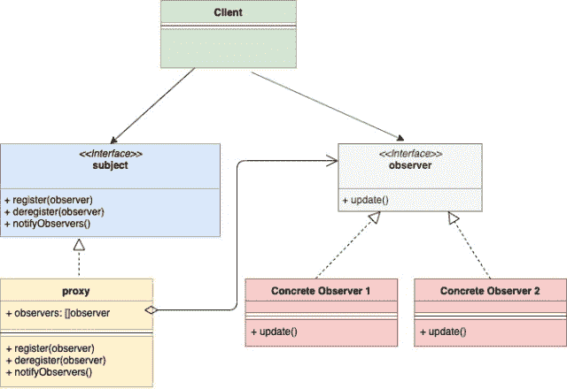

# 围棋中的观察者设计模式

> 原文：<https://golangbyexample.com/observer-design-pattern-golang>

注意:有兴趣了解如何在 GO 中实现所有其他设计模式。请参阅此完整参考资料–[Go(Golang)](https://golangbyexample.com/all-design-patterns-golang/)中的所有设计模式

# **简介:**

观察者设计模式是一种行为设计模式。这种模式允许一个实例**(称为主体)**向其他多个实例**(称为观察者)发布事件。**这些**观察者**订阅**主题**，因此在**主题发生任何变化时会收到事件通知。**

举个例子吧。在电子商务网站上，许多商品缺货。可能会有客户对某个缺货的商品感兴趣。这个问题有三个解决方案

1.  客户以一定的频率不断检查商品的可用性。
2.  电子商务用所有现有的新商品轰炸顾客
3.  客户只订阅他感兴趣的特定项目，并在该项目可用的情况下收到通知。此外，多个客户可以订阅同一产品

选项 3 是最可行的，这就是观察者模式的全部内容。观察者模式的主要组成部分是:

1.  **主题**–当任何事情发生变化时，它是发布事件的实例。
2.  **观察者**–它订阅主题并得到事件的通知。

一般来说，**主体**和**观察者**作为一个接口来实现。使用两者的具体实现

# **UML 图:**

<figure class="wp-block-image size-large"></figure>

# **映射:**

下表显示了
下面**【实际示例】**中从 UML 图参与者到实际实现参与者的映射

<figure class="wp-block-table is-style-stripes">

| 科目 | 主题。开始 |
| 具体学科 | 项目。开始 |
| 观察者 | 观察者。开始 |
| 混凝土观察者 1 | 顾客。开始 |
| 客户 | main.go |

</figure>

# **实例:**

**主题开始**

```go
package main

type subject interface {
    register(Observer observer)
    deregister(Observer observer)
    notifyAll()
}
```

**项目开始**

```go
package main

import "fmt"

type item struct {
    observerList []observer
    name         string
    inStock      bool
}

func newItem(name string) *item {
    return &item{
        name: name,
    }
}

func (i *item) updateAvailability() {
    fmt.Printf("Item %s is now in stock\n", i.name)
    i.inStock = true
    i.notifyAll()
}

func (i *item) register(o observer) {
    i.observerList = append(i.observerList, o)
}

func (i *item) deregister(o observer) {
    i.observerList = removeFromslice(i.observerList, o)
}

func (i *item) notifyAll() {
    for _, observer := range i.observerList {
        observer.update(i.name)
    }
}

func removeFromslice(observerList []observer, observerToRemove observer) []observer {
    observerListLength := len(observerList)
    for i, observer := range observerList {
        if observerToRemove.getID() == observer.getID() {
            observerList[observerListLength-1], observerList[i] = observerList[i], observerList[observerListLength-1]
            return observerList[:observerListLength-1]
        }
    }
    return observerList
}
```

**观察者. go**

```go
package main

type observer interface {
    update(string)
    getID() string
}
```

**customer.go**

```go
package main

import "fmt"

type customer struct {
    id string
}

func (c *customer) update(itemName string) {
    fmt.Printf("Sending email to customer %s for item %s\n", c.id, itemName)
}

func (c *customer) getID() string {
    return c.id
}
```

**main.go**

```go
package main

func main() {
    shirtItem := newItem("Nike Shirt")
    observerFirst := &customer{id: "[[email protected]](/cdn-cgi/l/email-protection)"}
    observerSecond := &customer{id: "[[email protected]](/cdn-cgi/l/email-protection)"}
    shirtItem.register(observerFirst)
    shirtItem.register(observerSecond)
    shirtItem.updateAvailability()
}
```

**输出:**

```go
Item Nike Shirt is now in stock
Sending email to customer [[email protected]](/cdn-cgi/l/email-protection) for item Nike Shirt
Sending email to customer [[email protected]](/cdn-cgi/l/email-protection) for item Nike Shirt
```

# **完整工作代码:**

```go
package main

import "fmt"

type subject interface {
    register(Observer observer)
    deregister(Observer observer)
    notifyAll()
}

type item struct {
    observerList []observer
    name         string
    inStock      bool
}

func newItem(name string) *item {
    return &item{
        name: name,
    }
}

func (i *item) updateAvailability() {
    fmt.Printf("Item %s is now in stock\n", i.name)
    i.inStock = true
    i.notifyAll()
}

func (i *item) register(o observer) {
    i.observerList = append(i.observerList, o)
}

func (i *item) deregister(o observer) {
    i.observerList = removeFromslice(i.observerList, o)
}

func (i *item) notifyAll() {
    for _, observer := range i.observerList {
        observer.update(i.name)
    }
}

func removeFromslice(observerList []observer, observerToRemove observer) []observer {
    observerListLength := len(observerList)
    for i, observer := range observerList {
        if observerToRemove.getID() == observer.getID() {
            observerList[observerListLength-1], observerList[i] = observerList[i], observerList[observerListLength-1]
            return observerList[:observerListLength-1]
        }
    }
    return observerList
}

type observer interface {
    update(string)
    getID() string
}

type customer struct {
    id string
}

func (c *customer) update(itemName string) {
    fmt.Printf("Sending email to customer %s for item %s\n", c.id, itemName)
}

func (c *customer) getID() string {
    return c.id
}

func main() {
    shirtItem := newItem("Nike Shirt")
    observerFirst := &customer{id: "[[email protected]](/cdn-cgi/l/email-protection)"}
    observerSecond := &customer{id: "[[email protected]](/cdn-cgi/l/email-protection)"}
    shirtItem.register(observerFirst)
    shirtItem.register(observerSecond)
    shirtItem.updateAvailability()
}
```

**输出:**

```go
Item Nike Shirt is now in stock
Sending email to customer [[email protected]](/cdn-cgi/l/email-protection) for item Nike Shirt
Sending email to customer [[email protected]](/cdn-cgi/l/email-protection) for item Nike Shirt
```