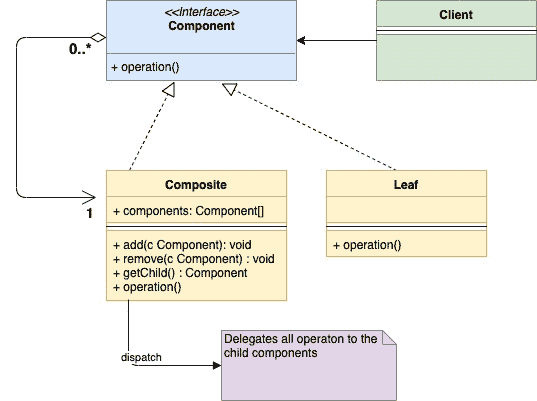
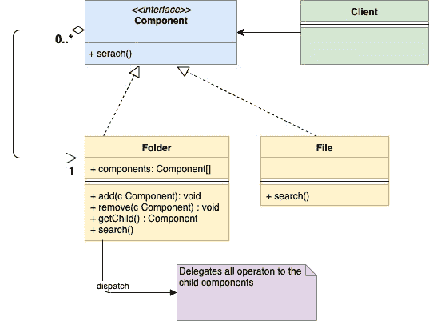

# 组合设计模式

> 原文：<https://golangbyexample.com/composite-design-pattern-golang/>

注意:有兴趣了解如何在 GO 中实现所有其他设计模式。请参阅此完整参考资料–[Golang](https://golangbyexample.com/all-design-patterns-golang/)中的所有设计模式

## **定义:**

这是一种结构设计模式。当我们希望一组称为“组合”的对象以类似的方式被视为单个对象时，就使用了组合设计模式。它属于结构设计模式，因为它允许您将对象组合成树形结构。树结构中的每个对象都可以用相同的方式处理，不管它们是复杂的还是原始的。
我们试着用一个 OS 的文件系统的例子来理解。在文件系统中，有两种类型的对象**文件**和**文件夹。**有些情况下，文件和文件夹被视为相同的方式。随着我们的前进，情况会变得更清楚。

##  **何时使用**

*   从客户的角度来看，当组合对象和单个对象需要以相同的方式处理时，组合设计模式是有意义的。

–在我们上面的文件系统示例中，假设需要执行特定关键字的搜索操作。现在，该搜索操作适用于**文件**和**文件夹。**对于一个**文件，**它将只查看该文件的内容，而对于一个**文件夹，**它将在该文件夹的层次结构中的所有文件中查找该关键字

*   当组合对象和单个对象形成树状结构时，使用这种模式

–在我们的示例中，**文件**和**文件夹**形成了一个树形结构

## **UML 图**

*   **组件**–该接口定义了**组合**和**叶**对象的常见操作
*   **Composite–**它实现了**组件**接口，并嵌入了一组子**组件**
*   **叶–**它是树中的原始对象。还实现了**组件**接口

<figure class="wp-block-image"></figure>

下面是上面给出的例子对应的映射 UML 图

<figure class="wp-block-image"></figure>

## **映射**

下表显示了从 UML 图参与者到代码中实际实现参与者的映射。

<figure class="wp-block-table is-style-stripes">

| 组件接口 | 组件。开始 |
| 组合材料 | 文件夹。开始 |
| 叶子 | 文件。开始 |
| 客户 | main.go |

</figure>

## **实例**

在**组件下面的例子中**是接口，**文件**和**文件夹**实现这个接口**。**

**组件转到**

```go
package main

type component interface {
    search(string)
}
```

**文件夹. go**

```go
package main

import "fmt"

type folder struct {
    components []component
    name       string
}

func (f *folder) search(keyword string) {
    fmt.Printf("Serching recursively for keyword %s in folder %s\n", keyword, f.name)
    for _, composite := range f.components {
        composite.search(keyword)
    }
}

func (f *folder) add(c component) {
    f.components = append(f.components, c)
}
```

**文件转到**

```go
package main

import "fmt"

type file struct {
    name string
}

func (f *file) search(keyword string) {
    fmt.Printf("Searching for keyword %s in file %s\n", keyword, f.name)
}

func (f *file) getName() string {
    return f.name
}
```

**main.go**

```go
package main

func main() {
    file1 := &file{name: "File1"}
    file2 := &file{name: "File2"}
    file3 := &file{name: "File3"}
    folder1 := &folder{
        name: "Folder1",
    }
    folder1.add(file1)
    folder2 := &folder{
        name: "Folder2",
    }
    folder2.add(file2)
    folder2.add(file3)
    folder2.add(folder1)
    folder2.search("rose")
}
```

**输出:**

```go
Serching recursively for keyword rose in folder Folder2
Searching for keyword rose in file File2
Searching for keyword rose in file File3
Serching recursively for keyword rose in folder Folder1
Searching for keyword rose in file File1
```