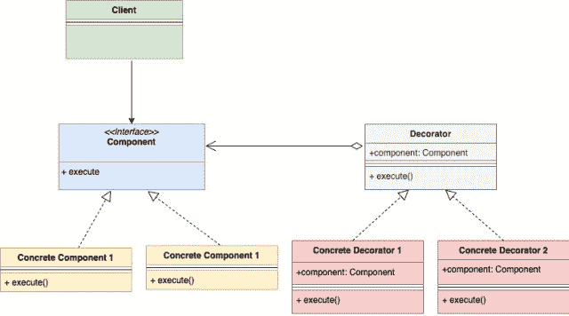

# 装饰器设计模式

> 原文：<https://golangbyexample.com/decorator-pattern-golang/>

# **概述**

装饰设计模式是一种结构设计模式。它允许您在不改变对象的情况下提供附加功能或装饰对象。

用一个例子更好理解。想象你正在开一家披萨连锁店。你从两种披萨开始

*   看看比萨店
*   Peppy 豆腐披萨

上述每种比萨饼都有它的价格。所以你可以创建一个如下所示的披萨接口

```go
package main

type pizza interface {
	getPrice() int
}
```

你还需要创建两个带有**获取价格**函数的披萨结构，该函数将返回价格。这两个 pizza 结构在定义 getPrice()方法时实现了 pizza 接口

后来，你开始提供浇头和比萨饼，每种浇头都有一些额外的价格。所以最初的基础比萨现在需要用顶层装饰。想象一下你在菜单上加了两种配料

*   番茄浇头
*   奶酪浇头

此外，请记住，比萨饼连同顶部也是比萨饼。顾客可以用不同的方式选择他们的比萨饼。例如

*   番茄浇头的蔬菜热
*   蔬菜主菜配番茄和奶酪
*   没有任何浇头的精力充沛的帕内尔比萨饼
*   奶酪浇头的活力派比萨
*   …

那么你现在会怎么设计呢，既然你现在也有浇头了。装饰图案将进入画面。它可以帮助实现额外的功能，而无需实际修改任何现有的结构。在这种情况下，Decorator 模式建议为每个可用的顶层创建单独的结构。每个 top struct 都将实现上面的 pizza 接口，并且还有一个 pizza 的嵌入和实例。

我们现在对不同类型的比萨有单独的结构，对可用的浇头类型也有单独的结构。每种比萨饼和浇头都有自己的价格。无论何时你在比萨饼上加任何配料，配料的价格都会加到基础比萨饼的价格上，这就是你得到最终价格的方法。

所以装饰器模式让你在不改变披萨对象的情况下装饰原始的基础披萨对象。披萨对象对浇头一无所知。它只知道它的价格，别的什么都不知道。

# **UML 图**

下面是装饰器设计模式的 UML 图

<figure class="wp-block-image size-large"></figure>

混凝土构件(此处为**素食主义者狂热****Peppy 豆腐**)和混凝土装饰器(此处为**浇头**)实现构件接口(此处为**披萨**)。混凝土装饰器也将嵌入一个组件实例。

如下例所示

*   该组件由 pizza 接口表示

*   混凝土构件由**素食主义**和**派普潘纳**T4 结构表示。他们都实现了披萨接口

*   混凝土装饰用奶酪浇头和托马托平结构来表示。他们都实现了披萨接口。此外，他们还嵌入了一个比萨饼类型的实例

# **代号**

**比萨。去**

```go
package main

type pizza interface {
	getPrice() int
}
```

**peppypaner . go**

```go
package main

type peppyPaneer struct {
}

func (p *peppyPaneer) getPrice() int {
	return 20
}
```

**veg mania . go**

```go
package main

type veggeMania struct {
}

func (p *veggeMania) getPrice() int {
	return 15
}
```

**奶酪浇头. go**

```go
package main

type cheeseTopping struct {
	pizza pizza
}

func (c *cheeseTopping) getPrice() int {
	pizzaPrice := c.pizza.getPrice()
	return pizzaPrice + 10
}
```

**to ToToPopping . go**

```go
package main
type tomatoTopping struct {
    pizza pizza
}
func (c *tomatoTopping) getPrice() int {
    pizzaPrice := c.pizza.getPrice()
    return pizzaPrice + 7
}
```

**main.go**

```go
package main

import "fmt"

func main() {

	veggiePizza := &veggeMania{}

	//Add cheese topping
	veggiePizzaWithCheese := &cheeseTopping{
		pizza: veggiePizza,
	}

	//Add tomato topping
	veggiePizzaWithCheeseAndTomato := &tomatoTopping{
		pizza: veggiePizzaWithCheese,
	}

	fmt.Printf("Price of veggieMania pizza with tomato and cheese topping is %d\n", veggiePizzaWithCheeseAndTomato.getPrice())

	peppyPaneerPizza := &peppyPaneer{}

	//Add cheese topping
	peppyPaneerPizzaWithCheese := &cheeseTopping{
		pizza: peppyPaneerPizza,
	}

	fmt.Printf("Price of peppyPaneer with tomato and cheese topping is %d\n", peppyPaneerPizzaWithCheese.getPrice())
}
```

**输出**

```go
Price of veggieMania pizza with tomato and cheese topping is 32
Price of peppyPaneer with tomato and cheese topping is 30
```

# **全工作码**

```go
package main

import "fmt"

type pizza interface {
	getPrice() int
}

type peppyPaneer struct {
}

func (p *peppyPaneer) getPrice() int {
	return 20
}

type veggeMania struct {
}

func (p *veggeMania) getPrice() int {
	return 15
}

type tomatoTopping struct {
	pizza pizza
}

func (c *tomatoTopping) getPrice() int {
	pizzaPrice := c.pizza.getPrice()
	return pizzaPrice + 7
}

type cheeseTopping struct {
	pizza pizza
}

func (c *cheeseTopping) getPrice() int {
	pizzaPrice := c.pizza.getPrice()
	return pizzaPrice + 10
}

func main() {

	veggiePizza := &veggeMania{}

	//Add cheese topping
	veggiePizzaWithCheese := &cheeseTopping{
		pizza: veggiePizza,
	}

	//Add tomato topping
	veggiePizzaWithCheeseAndTomato := &tomatoTopping{
		pizza: veggiePizzaWithCheese,
	}

	fmt.Printf("Price of veggieMania pizza with tomato and cheese topping is %d\n", veggiePizzaWithCheeseAndTomato.getPrice())

	peppyPaneerPizza := &peppyPaneer{}

	//Add cheese topping
	peppyPaneerPizzaWithCheese := &cheeseTopping{
		pizza: peppyPaneerPizza,
	}

	fmt.Printf("Price of peppyPaneer with tomato and cheese topping is %d\n", peppyPaneerPizzaWithCheese.getPrice())
}
```

**输出**

```go
Price of veggieMania pizza with tomato and cheese topping is 32
Price of peppyPaneer with tomato and cheese topping is 30
```