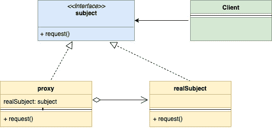
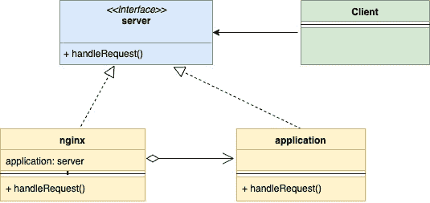

# 围棋中的代理设计模式

> 原文：<https://golangbyexample.com/proxy-design-pattern-in-golang/>

注意:有兴趣了解如何在 GO 中实现所有其他设计模式。请参阅此完整参考资料–[Go(Golang)](https://golangbyexample.com/all-design-patterns-golang/)中的所有设计模式

## **简介:**

代理设计模式是一种结构设计模式。这种模式建议提供一个额外的间接层来控制和智能地访问主对象。

在这个模式中，创建了一个新的代理类，它实现了与主对象相同的接口。这允许您在主对象的实际逻辑之前执行一些行为。让我们用一个例子来更好地理解它

1.  借记卡是你银行账户的代理。它遵循与银行账户相同的界面，更容易使用。
2.  像 Nginx 这样的网络服务器可以作为应用服务器的代理。它提供了
    *   对应用服务器的受控访问–例如，它可以进行速率限制
    *   其他行为–例如，它可以进行一些缓存

让我们看看 UML 图

## **UML 图:**

在下面的 UML 图中

*   **Subject:** 代表代理和 realSubject 应该遵循的接口
*   **代理**:代理类嵌入 realSubject，并在 realSubject 完成处理后将请求传递给它
*   **RealSubject** :这是保存主要业务逻辑的类，它被保存在代理后面
*   **客户端:**可以与代理和真实主体交互，因为它们都遵循相同的界面。

<figure class="wp-block-gallery columns-1 is-cropped">

*   <figure></figure>

</figure>

下面是上面描述的 nginx 和应用服务器的实例对应的映射 UML 图。

<figure class="wp-block-gallery columns-1 is-cropped">

*   <figure></figure>

</figure>

## **映射**

下表表示代码中从 UML 图参与者到实际实现参与者的映射

<figure class="wp-block-table is-style-stripes">

| 科目 | 服务器. go |
| 代理人 | 坚尼克斯，走 |
| 真实主题 | 应用程序. go |
| 客户 | main.go |

</figure>

## **实例:**

**server.go**

```go
package main

type server interface {
    handleRequest(string, string) (int, string)
}
```

**engine . go**

```go
package main

type nginx struct {
    application       *application
    maxAllowedRequest int
    rateLimiter       map[string]int
}

func newNginxServer() *nginx {
    return &nginx{
        application:       &application{},
        maxAllowedRequest: 2,
        rateLimiter:       make(map[string]int),
    }
}

func (n *nginx) handleRequest(url, method string) (int, string) {
    allowed := n.checkRateLimiting(url)
    if !allowed {
        return 403, "Not Allowed"
    }
    return n.application.handleRequest(url, method)
}

func (n *nginx) checkRateLimiting(url string) bool {
    if n.rateLimiter[url] == 0 {
        n.rateLimiter[url] = 1
    }
    if n.rateLimiter[url] > n.maxAllowedRequest {
        return false
    }
    n.rateLimiter[url] = n.rateLimiter[url] + 1
    return true
}
```

**应用开始**

```go
package main

type application struct {
}

func (a *application) handleRequest(url, method string) (int, string) {
    if url == "/app/status" && method == "GET" {
        return 200, "Ok"
    }
    if url == "/create/user" && method == "POST" {
        return 201, "User Created"
    }
    return 404, "Not Ok"
}
```

**main.go**

```go
package main

import "fmt"

func main() {
    nginxServer := newNginxServer()
    appStatusURL := "/app/status"
    createuserURL := "/create/user"
    httpCode, body := nginxServer.handleRequest(appStatusURL, "GET")
    fmt.Printf("\nUrl: %s\nHttpCode: %d\nBody: %s\n", appStatusURL, httpCode, body)
    httpCode, body = nginxServer.handleRequest(appStatusURL, "GET")
    fmt.Printf("\nUrl: %s\nHttpCode: %d\nBody: %s\n", appStatusURL, httpCode, body)
    httpCode, body = nginxServer.handleRequest(appStatusURL, "GET")
    fmt.Printf("\nUrl: %s\nHttpCode: %d\nBody: %s\n", appStatusURL, httpCode, body)
    httpCode, body = nginxServer.handleRequest(createuserURL, "POST")
    fmt.Printf("\nUrl: %s\nHttpCode: %d\nBody: %s\n", appStatusURL, httpCode, body)
    httpCode, body = nginxServer.handleRequest(createuserURL, "GET")
    fmt.Printf("\nUrl: %s\nHttpCode: %d\nBody: %s\n", appStatusURL, httpCode, body)
}
```

**输出:**

```go
Url: /app/status
HttpCode: 200
Body: Ok

Url: /app/status
HttpCode: 200
Body: Ok

Url: /app/status
HttpCode: 403
Body: Not Allowed

Url: /app/status
HttpCode: 201
Body: User Created

Url: /app/status
HttpCode: 404
Body: Not Ok
```

## **完整工作代码:**

```go
package main

import "fmt"

type server interface {
    handleRequest(string, string) (int, string)
}

type nginx struct {
    application       *application
    maxAllowedRequest int
    rateLimiter       map[string]int
}

func newNginxServer() *nginx {
    return &nginx{
        application:       &application{},
        maxAllowedRequest: 2,
        rateLimiter:       make(map[string]int),
    }
}

func (n *nginx) handleRequest(url, method string) (int, string) {
    allowed := n.checkRateLimiting(url)
    if !allowed {
        return 403, "Not Allowed"
    }
    return n.application.handleRequest(url, method)
}

func (n *nginx) checkRateLimiting(url string) bool {
    if n.rateLimiter[url] == 0 {
        n.rateLimiter[url] = 1
    }
    if n.rateLimiter[url] > n.maxAllowedRequest {
        return false
    }
    n.rateLimiter[url] = n.rateLimiter[url] + 1
    return true
}

type application struct {
}

func (a *application) handleRequest(url, method string) (int, string) {
    if url == "/app/status" && method == "GET" {
        return 200, "Ok"
    }
    if url == "/create/user" && method == "POST" {
        return 201, "User Created"
    }
    return 404, "Not Ok"
}

func main() {
    nginxServer := newNginxServer()
    appStatusURL := "/app/status"
    createuserURL := "/create/user"
    httpCode, body := nginxServer.handleRequest(appStatusURL, "GET")
    fmt.Printf("\nUrl: %s\nHttpCode: %d\nBody: %s\n", appStatusURL, httpCode, body)
    httpCode, body = nginxServer.handleRequest(appStatusURL, "GET")
    fmt.Printf("\nUrl: %s\nHttpCode: %d\nBody: %s\n", appStatusURL, httpCode, body)
    httpCode, body = nginxServer.handleRequest(appStatusURL, "GET")
    fmt.Printf("\nUrl: %s\nHttpCode: %d\nBody: %s\n", appStatusURL, httpCode, body)
    httpCode, body = nginxServer.handleRequest(createuserURL, "POST")
    fmt.Printf("\nUrl: %s\nHttpCode: %d\nBody: %s\n", appStatusURL, httpCode, body)
    httpCode, body = nginxServer.handleRequest(createuserURL, "GET")
    fmt.Printf("\nUrl: %s\nHttpCode: %d\nBody: %s\n", appStatusURL, httpCode, body)
}
```

**输出:**

```go
Url: /app/status
HttpCode: 200
Body: Ok

Url: /app/status
HttpCode: 200
Body: Ok

Url: /app/status
HttpCode: 403
Body: Not Allowed

Url: /app/status
HttpCode: 201
Body: User Created

Url: /app/status
HttpCode: 404
Body: Not Ok
```