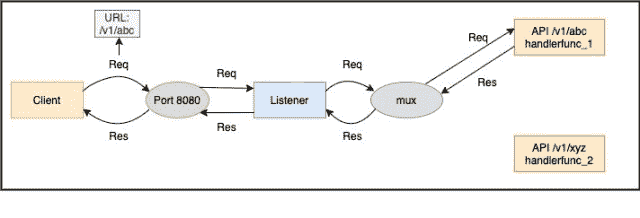
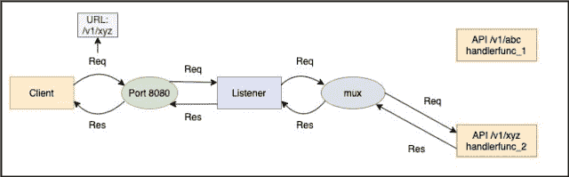

# 使用 Golang实现基本的 HTTP 服务器

> 原文：<https://golangbyexample.com/basic-http-server-go>

# **概述**

HTTP(超文本传输协议)是一种应用层协议，工作在客户机-服务器模式。HTTP 服务器基本上是一个运行在机器上的程序。它使用特定的端口监听并响应其 IP 地址上的 HTTP 请求。由于 HTTP 是万维网的基础，用于加载任何网页，每个软件开发人员都会遇到这样的情况，即需要实现一个 HTTP 服务器来响应 HTTP 请求。

本文介绍了用 Go 编程语言实现 HTTP 服务器。有一个 go 包 **net** ，其中包含处理网络功能的实用程序包。

**net** 包包含 http 包，提供 http 客户端(进行 http 请求)和 HTTP 服务器(监听 HTTP 请求)的实现。在本文中，我们将了解 HTTP 服务器。下面是导入 http 包的语句:

```go
import "net/http"
```

理解 http 服务器实现的关键是理解下面的事情

*   **请求**–定义请求参数，即方法、Api 签名、请求头、主体、查询参数等

*   **响应**–定义响应参数，即状态代码、响应正文、标题

*   **一对 API 签名及其处理程序**–每个 API 签名对应一个处理程序。您可以将 handler 看作是一个函数，当请求特定的 API 签名时会调用它。**多路复用器**注册这些 API 签名对及其处理程序

*   **多路复用器**–它充当路由器。根据请求的应用编程接口签名，它将请求路由到该应用编程接口签名的注册处理程序。处理程序将处理传入的请求并提供响应。例如，使用**"/v2/教师"**的 API 调用可能由不同的函数处理，而使用**"/v2/学生"**的 API 调用可能由其他函数处理。因此，基本上基于应用编程接口签名(有时也包括请求方法)，它决定调用哪个处理程序。

*   **监听器**–它运行在机器上，机器监听特定的端口。每当它在该端口上接收到请求时，它就将请求转发给**多路复用器**。它还处理其他功能，但我们不会在本文中讨论这些功能。

说到 HTTP，还有更多，但为了简单起见，我们只讨论了以上五件事。下图显示了来自客户端的应用编程接口请求的交互。

我们来看一个例子。下面两对应用编程接口签名和处理程序在**多路复用器中注册。**

*   **"/v1/abc"** 和 **handlerfunc_1**

*   **"/v1/xyz"** 和 **handlerfunc_2**

客户端调用**”/v1/ABC”**API。监听器将其转发到**多路复用器**和**多路复用器**将其路由到适当的处理器 **handlerfunc_1**

<figure class="wp-block-image size-large"></figure>

客户端调用 **"/v1/xyz"** API。监听器将其转发到**多路复用器**和**多路复用器**将其路由到适当的处理器 **handlerfunc_2**

<figure class="wp-block-image size-large"></figure>

现在我们已经理解了上面的部分，所以让我们继续看看上面的每一部分是如何在 GO 中实现的，最后我们将看到一个完整的程序，包含整个端到端流程

## **请求**

在 GO 中，请求由**请求**结构表示。这是结构的链接–[https://golang.org/pkg/net/http/#Request](https://golang.org/pkg/net/http/#Request)

它包含请求方法、Api 签名、请求头、主体、查询参数等。

## **回应**

在 GO 中，响应由**响应编写器**接口表示。这是到接口的链接–[https://golang.org/pkg/net/http/#ResponseWriter](https://golang.org/pkg/net/http/#ResponseWriter)响应器接口被一个 HTTP 处理程序用来构造一个 HTTP 响应。它提供三个功能来设置响应参数

*   标题–用于写入响应标题

*   写入([]字节)–用于写入响应正文

*   写头(statusCode int)–用于写 http 状态代码

## **对 API 签名及其处理程序**

应用编程接口签名及其处理程序是成对的。然后，当接收到与应用编程接口签名匹配的应用编程接口调用时，多路复用器调用处理程序。golang 处理器可以是**功能**或**类型**

*   **功能**–该功能应具有以下签名

```go
func(ResponseWriter, *Request)
```

*   **类型**–该类型应实现**处理程序**接口

```go
type Handler interface {
   ServeHTTP(ResponseWriter, *Request)
}
```

让我们一个一个来看

*   **函数–**处理程序可以只是一个简单的函数，具有以下签名。

```go
func(ResponseWriter, *Request)
```

它接受的输入有两个参数。第一个是响应编写器，第二个是请求结构的指针。我们之前也讨论过这两个问题。

如果应用编程接口签名和具有上述签名的函数在**多路复用器**中注册为一对，那么当应用编程接口调用与应用编程接口签名匹配时，将调用该函数。

*   **类型–**类型应该实现**处理程序**接口–[https://golang.org/pkg/net/http/#Handler](https://golang.org/pkg/net/http/#Handler)

```go
type Handler interface {
   ServeHTTP(ResponseWriter, *Request)
}
```

**处理程序**接口定义了一个**服务功能**。如果一个应用编程接口签名和一个实现**处理程序**接口的类型在多路复用器中注册为一对，那么当一个应用编程接口调用与该应用编程接口签名匹配时，该类型的 **ServeHTTP** 方法将被调用。

如果你注意到**函数的 API 签名**用作处理程序和 **ListenAndServe** 函数是一样的

```go
func(ResponseWriter, *Request)
```

根据处理程序的类型，这些函数将由 mux 调用。还要注意，两个不同的 API Signature 可以有相同的处理程序

## **Mux**

多路复用器的工作是根据应用编程接口签名将请求路由到注册的处理程序(有时也请求方法)。如果签名及其处理程序没有向 mux 注册，它将引发 404

Go 提供了一个内置于语言中的默认多路复用器–[https://golang.org/pkg/net/http/#ServeMux](https://golang.org/pkg/net/http/#ServeMux)。市场上还有其他 mux 可供 golang 使用。不同的网络框架，如 gin，提供了自己的 mux

这就是我们创建多路复用器的方法

```go
mux := http.NewServeMux()
```

让我们看看如何向多路复用器注册一对应用编程接口签名及其处理程序。有两种情况

*   当处理器是**功能**时。它将作为 API 签名的模式和函数注册为处理程序

```go
mux.HandleFunc(pattern, handlerFunc)
```

*   当处理程序为**类型时**实现**处理程序**接口

```go
mux.Handle(pattern, handler)
```

## **听者**

监听器监听一个端口，并将请求转发给**多路复用器**，然后等待响应。一旦它收到响应，它就将它发送回客户端。golang 中的侦听器可以使用服务器结构–[https://golang.org/pkg/net/http/#Server](https://golang.org/pkg/net/http/#Server)来实现

这就是我们创建服务器的方式。在创建服务器时，我们还可以指定一些其他参数，如读超时、写超时等。，但这超出了本教程的范围。所有未提供的参数都采用默认的零值。

```go
s := &http.Server{
  Addr:    ":8080",
  Handler: mux,
}
```

类型字符串的 **Addr** 属性是将启动 HTTP 服务器的机器的地址。

这个地址的形式是

```go
{ip_address}:{port}
```

如果仅将{port}用作 **addr** 参数，则意味着可以从机器的所有 ip 地址(环回、公共 ip、内部 ip)访问 HTTP 服务器。

也可以使用**:**作为地址端口**的 **addr** 参数值:80”**、**:**作为地址端口**::443”**

这里需要注意的非常重要的一点是 **ServerMux** 也有一个 **ServeHttp** 方法[https://golang.org/pkg/net/http/#ServeMux.ServeHTTP](https://golang.org/pkg/net/http/#ServeMux.ServeHTTP)。所以 **ServerMux** 也实现了 **Handler** 接口，因为它定义了 **ServeHttp** 方法。在创建服务器时，您可能已经注意到，我们必须提供一个类型为**处理程序**接口的处理程序。这就是**服务器复用**实现**处理程序**接口的地方，因为我们可以在创建服务器时传递**服务器复用**的实例。这对于理解**服务器多路复用器**是类型**处理程序**接口很重要，除了注册不同对的应用编程接口签名和它们的处理程序。

创建服务器后，我们调用**服务器**的**列表和服务器**方法。然后，服务器开始监听所提供的端口，并在接收到该端口上的任何 api 调用时，调用 **mux** 的 **ServeHttp** ，该 mux 依次将请求路由到注册的 handlerHope。以上五件事现在都清楚了。让我们看一个工作程序来说明以上几点

# **使用服务器的 ListenAndServe 功能**

**main.go**

```go
package main

import (
	"net/http"
)

func main() {

	//Create the default mux
	mux := http.NewServeMux()

	//Handling the /v1/teachers. The handler is a function here
	mux.HandleFunc("/v1/teachers", teacherHandler)

	//Handling the /v1/students. The handler is a type implementing the Handler interface here
	sHandler := studentHandler{}
	mux.Handle("/v1/students", sHandler)

	//Create the server. 
	s := &http.Server{
		Addr:    ":8080",
		Handler: mux,
	}
	s.ListenAndServe()

}

func teacherHandler(res http.ResponseWriter, req *http.Request) {
	data := []byte("V1 of teacher's called")
	res.WriteHeader(200)
	res.Write(data)
}

type studentHandler struct{}

func (h studentHandler) ServeHTTP(res http.ResponseWriter, req *http.Request) {
	data := []byte("V1 of student's called")
	res.WriteHeader(200)
	res.Write(data)
}
```

让我们先了解程序，然后再运行它

*   我们定义了一个名为**教师处理器**的函数，它具有接受 **http 的签名。响应记录器**和指向**的指针。请求**

```go
func teacherHandler(res http.ResponseWriter, req *http.Request) {
	data := []byte("V1 of teacher's called")
	res.Header().Set("Content-Type", "application/text")
	res.WriteHeader(200)
	res.Write(data)
}
```

*   我们定义了一个名为 **studentHandler** 的结构，它定义了 **ServeHTTP** 方法。所以**学生处理程序**是实现**处理程序**接口的类型

```go
type studentHandler struct{}

func (h studentHandler) ServeHTTP(res http.ResponseWriter, req *http.Request) {
	data := []byte("V1 of student's called")
	res.Header().Set("Content-Type", "application/text")
	res.WriteHeader(200)
	res.Write(data)
}
```

*   我们创建一个**服务器的实例**

```go
mux := http.NewServeMux()
```

*   我们注册了一对 API 签名“/v1/教师”及其处理程序**教师处理程序**

```go
mux.HandleFunc("/v1/teachers", teacherHandler)
```

*   我们注册了一对 API 签名“/v1/students”及其处理程序 **studentHandler** ，这是一个实现**处理程序**接口的类型

```go
sHandler := studentHandler{}
mux.Handle("/v1/students", sHandler)
```

*   我们创建了服务器，并为其提供了 **ServerMux** 的实例以及要监听的端口 8080。然后调用服务器实例上的 **ListenAndServe** 方法。

```go
s := &http.Server{
		Addr:    ":8080",
		Handler: mux,
	}
s.ListenAndServe()
```

让我们现在运行服务器

```go
go run main.go
```

它将开始监听端口 8080。这个程序永远不会退出，并且进程保持锁定，直到强制终止，这是推荐的，因为任何 HTTP 服务器都应该一直启动和运行。现在进行 api 调用

调用**“v1/教师”**API–它返回正确的响应–教师调用的‘的‘**V1 以及正确的状态代码 200**

```go
curl -v -X GET http://localhost:8080/v1/teachers
Note: Unnecessary use of -X or --request, GET is already inferred.
*   Trying ::1...
* TCP_NODELAY set
* Connected to localhost (::1) port 8080 (#0)
> GET /v1/teachers HTTP/1.1
> Host: localhost:8080
> User-Agent: curl/7.54.0
> Accept: */*
> 
< HTTP/1.1 200 OK
< Content-Type: application/text
< Date: Sat, 11 Jul 2020 16:03:33 GMT
< Content-Length: 22
< 
* Connection #0 to host localhost left intact
V1 of teacher's called
```

调用**“v1/学生”** api -它返回正确的响应-学生调用的“的“ **V1”以及正确的状态代码 200**

```go
curl -v -X GET http://localhost:8080/v1/students
Note: Unnecessary use of -X or --request, GET is already inferred.
*   Trying ::1...
* TCP_NODELAY set
* Connected to localhost (::1) port 8080 (#0)
> GET /v1/students HTTP/1.1
> Host: localhost:8080
> User-Agent: curl/7.54.0
> Accept: */*
> 
< HTTP/1.1 200 OK
< Content-Type: application/text
< Date: Sat, 11 Jul 2020 16:04:27 GMT
< Content-Length: 22
< 
* Connection #0 to host localhost left intact
V1 of student's called
```

您也可以在浏览器上尝试这些 API

对于 API**"/v1/教师"**

<figure class="wp-block-image size-large"></figure>

对于 API**”/v1/学生”**

<figure class="wp-block-image size-large"></figure>

# **使用 http 的 ListenAndServe 功能**

所以我们看了一个程序，其中我们构建了一个 **mux** ，然后我们添加了成对的 API 签名和它们的处理程序。最后我们创建了一个服务器并启动了它。 **net/http** 包还提供了一个功能 **ListenAndServe** ，它创建了一个默认的服务器，并使用默认的 **mux** 来实现与我们上面讨论的相同的功能。这是启动 http 服务器的一种简单方法

**ListenAndServe** 函数有一个 **addr** 和**处理程序**作为它的输入参数，它启动一个 HTTP 服务器。它开始监听传入的 HTTP 请求，并在收到任何请求时提供服务。以下是**列表和服务器**功能的签名

```go
func ListenAndServe(addr string, handler Handler) error
```

下面是调用这个函数的方法

```go
http.ListenAndServe(:8080, nil)
```

如果你注意到上面我们调用了 **ListenAndServe** 函数，处理程序的值为零

```go
http.ListenAndServe(:8080, nil)
```

在这种情况下，将创建**ServeMux**([https://golang.org/pkg/net/http/#ServeMux](https://golang.org/pkg/net/http/#ServeMux))的默认实例

```go
package main

import (
	"net/http"
)

func main() {

	//Handling the /v1/teachers
	http.HandleFunc("/v1/teachers", teacherHandler)

	//Handling the /v1/students
	sHandler := studentHandler{}
	http.Handle("/v1/students", sHandler)

	http.ListenAndServe(":8080", nil)
}

func teacherHandler(res http.ResponseWriter, req *http.Request) {
	data := []byte("V1 of teacher's called")
	res.WriteHeader(200)
	res.Write(data)
}

type studentHandler struct{}

func (h studentHandler) ServeHTTP(res http.ResponseWriter, req *http.Request) {
	data := []byte("V1 of student's called")
	res.WriteHeader(200)
	res.Write(data)
}
```

net/http 包提供了**手柄功能**和**手柄。**这些函数的工作方式与 mux 的方法相同。

运行服务器

```go
go run main.go
```

输出将与我们上面讨论的相同。这都是关于 golang 中基本的 HTTP 服务器实现。

# **结论**

我们了解到可以通过两种方式创建 HTTP 服务器

*   使用服务器。列表和服务器-[https://golang.org/pkg/net/http/#Server.ListenAndServe](https://golang.org/pkg/net/http/#Server.ListenAndServe)

*   使用 http。列表和服务器-[https://golang.org/pkg/net/http/#ListenAndServe](https://golang.org/pkg/net/http/#ListenAndServe)

在内部，他们都在做同样的事情。第二个选项使用默认值，而第一个选项允许您显式创建 mux 和服务器实例，以便您可以指定更多选项，因此第一个选项更灵活。