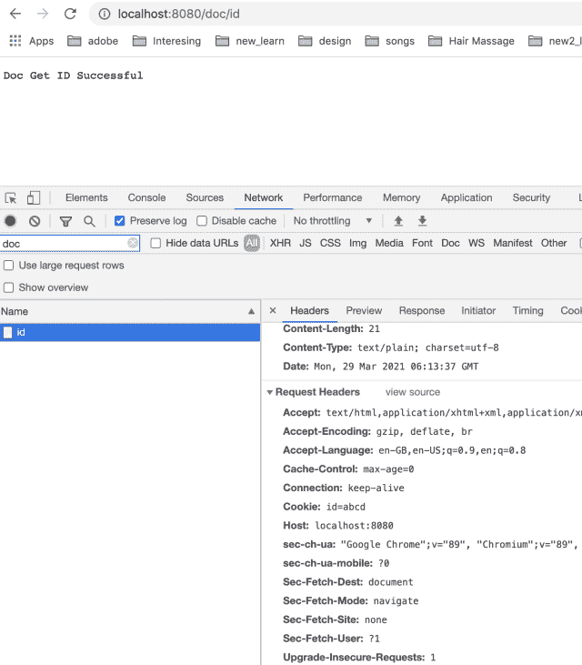

# 理解集合-Cookie 响应头

> 原文：<https://golangbyexample.com/set-cookie-response-header/>

# **设置 Cookie 响应头概述**

网络服务器可以将设置 Cookie 头发送回客户端或浏览器或任何其他用户代理。客户端应该在它的末端存储这个 cookie。该客户端将在每次请求时向服务器发送该 cookie。

你可以在这里大致了解一下 HTTP cookie–[https://en.wikipedia.org/wiki/HTTP_cookie](https://en.wikipedia.org/wiki/HTTP_cookie)

下面是设置 Cookie 头的语法

```go
Set-Cookie: <cookie_name>=<cookie_value>; Expires={some_date}; Max-Age={some_integer}; Domain={some_domain}; Path={some_path}; 
SameSite={Strict/Lax/None}</cookie_value></cookie_name>
```

下面是设置 Cookie 头的字段。这些字段通过**连接在一起**创建最终的设置 Cookie 头值

*   **名称=值**–这是表示<饼干名称>和<饼干值>的名称-值对。名称和数值用 **'='** 隔开。这是 cookie 的必填字段。所有其他字段都是可选字段

*   **Expires = { some _ date }**–它指定了 cookie 的最大生存期。它是日期格式的，并且 cookie 将在此之后过期。

*   **Max-Age = { some _ integer }**–表示 cookie 过期的秒数。如果同时指定了“过期”和“最大日期”，则“最长期限”优先

*   **域= { some _ Domain }**–它指定请求将被发送到的域

*   **路径= { some _ Path }**–客户端发送 cookies 所请求的 URI 中存在的路径。如果路径与请求的 URI 不匹配，客户端将不会发送 cookie。较高级别的路径与较低级别的路径匹配。因此/将匹配所有路径。While /employee 将匹配/employee，/employee/name，/employee/details

*   **安全**–该标志表示只有在发出 HTTPS 请求时，cookie 才会被发送到服务器

*   **HttpOnly**–启用此标志后，javascript 将无法访问 cookie。这是为了防止 CSRF 袭击

*   **相同站点** = **严格**或**松懈**或**无**–该选项控制浏览器进行跨来源调用时是否可以发送 cookies。

如上所述，这些字段可以使用**进行组合**创建最终的 Set-Cookie 头。这里需要注意的一点是，客户端只会将名称-值对发送回服务器，以便后续调用服务器。所有其他选项仅供客户使用。另外需要注意的一点是，服务器也可以在响应中发送多个 **Set-Cookie** 头。所有 Set-Cookie 响应头中的所有名称-值对将在后续调用中发送到服务器。

# **例**

这里有一些设置 Cookie 头的例子

*   仅名称-值对

```go
show_pop=true
```

*   带有过期字段的名称-值对

```go
show_pop=true; Expires=Tues, 27 Nov 2016 07:45:00 GMT
```

*   与其他字段的名称-值对

```go
show_pop=true; Expires=Tues, 27 Nov 2016 07:45:00 GMT; Domain=foo_test.com; SameSite=Strict
```

# **程序**

让我们看看 **Set-Cookie** 头的动作。我们将在 golang 看到这个例子。首先创建一个监听端口 8080 的 golang 服务器。创建两个应用编程接口

*   **localhost:8080/doc**–在该 API 中，服务器将在响应中设置 **Set-Cookie** 头。我们将通过浏览器进行此调用。浏览器将在结尾保存这个 cookie。浏览器随后会将相同的 cookie 发送回服务器，用于对 localhost:8080 的任何其他请求

*   **localhost:8080/doc/id**–这是一个示例应用编程接口，用于演示浏览器在请求中实际发送的 cookie 与在 Set-Cookie 头中作为响应接收的 Cookie 相同

让我们首先创建一个服务器

**go.mod**

```go
module sample.com/learn

go 1.16
```

**main.go**

```go
package main

import (
	"fmt"
	"net/http"
)

func main() {
	docHandler := http.HandlerFunc(docHandler)
	http.Handle("/doc", docHandler)

	docGetID := http.HandlerFunc(docGetID)
	http.Handle("/doc/id", docGetID)

	http.ListenAndServe(":8080", nil)
}

func docHandler(w http.ResponseWriter, r *http.Request) {
	cookie := &http.Cookie{
		Name:   "id",
		Value:  "abcd",
		MaxAge: 300,
	}
	http.SetCookie(w, cookie)
	w.WriteHeader(200)
	w.Write([]byte("Doc Get Successful"))
	return
}

func docGetID(w http.ResponseWriter, r *http.Request) {
	c, _ := r.Cookie("id")
	fmt.Println(c)
	w.WriteHeader(200)
	w.Write([]byte("Doc Get ID Successful"))
	return
}
```

在上面的代码中，我们有两个如上所述的 API。使用运行上述程序

```go
go run main.go
```

服务器将在端口 8080 上开始运行

现在从浏览器调用 **localhost:8080/doc** 的 API。服务器在响应中发送下面的**设置 Cookie**

```go
Set-Cookie: id=abcd; Max-Age=300
```

在 API 调用的响应头中也可以看到同样的情况。见下面截图

<figure class="wp-block-image size-large"></figure>

现在让我们从不同的选项卡进行另一个 API 调用。请注意，响应中会发回相同的 cookie。还要注意，只有名称-值对被发送回来，正如我们在本文上面提到的

<figure class="wp-block-image size-large"></figure>

查看我们的 Golang 综合教程系列–[Golang 综合教程](https://golangbyexample.com/golang-comprehensive-tutorial/)