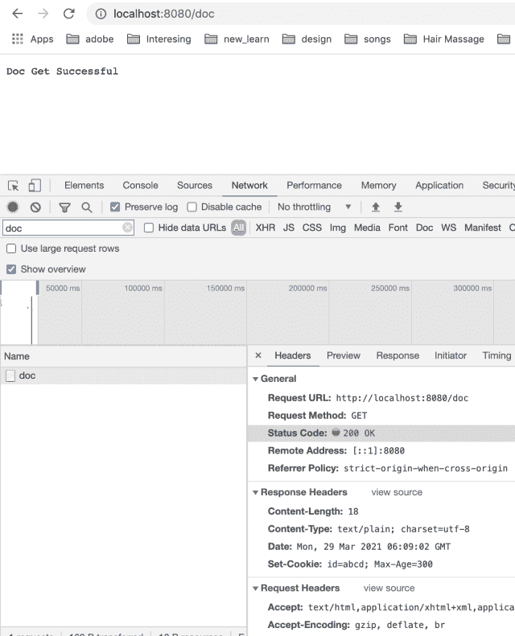

# Cookie

> 原文：<https://golangbyexample.com/cookies-golang/>

## **什么是Cookie**

Cookies 是在客户端存储信息的一种方式。客户端可以是浏览器、移动应用或发出 HTTP 请求的任何东西。Cookies 基本上是存储在浏览器缓存中的一些文件。当你浏览任何支持 cookie 的网站时，会在 cookie 中删除一些与你的活动相关的信息。这些信息可能是任何东西。简而言之，Cookies 存储用户活动的历史信息。这些信息存储在客户端计算机上。由于 cookie 存储在文件中，因此即使用户关闭浏览器窗口或重新启动计算机，这些信息也不会丢失。cookie 也可以存储登录信息。事实上，令牌等登录信息通常只存储在 cookies 中。Cookies 按域存储。本地存储的属于特定域的 Cookies 会在每个请求中发送到该域。它们作为标头的一部分在每个请求中发送。所以本质上 cookie 只是一个标题。

你可以在这里大致了解一下 HTTP cookie–[https://en.wikipedia.org/wiki/HTTP_cookie](https://en.wikipedia.org/wiki/HTTP_cookie)

Cookie可以送

*   作为一个 Cookie 头

*   作为 HTTP 服务器的 HTTP 响应中的设置 cookie 头

golang 中的Cookie如下所示

[https://golang.org/src/net/http/cookie.go](https://golang.org/src/net/http/cookie.go)

```go
type Cookie struct {
	Name  string
	Value string

	Path       string    // optional
	Domain     string    // optional
	Expires    time.Time // optional
	RawExpires string    // for reading cookies only

	// MaxAge=0 means no 'Max-Age' attribute specified.
	// MaxAge<0 means delete cookie now, equivalently 'Max-Age: 0'
	// MaxAge>0 means Max-Age attribute present and given in seconds
	MaxAge   int
	Secure   bool
	HttpOnly bool
	SameSite SameSite
	Raw      string
	Unparsed []string // Raw text of unparsed attribute-value pairs
}
```

参见[https://tools.ietf.org/html/rfc6265](https://tools.ietf.org/html/rfc6265)了解上述 cookie 的每个字段的详细信息。

让我们详细看看与 cookies 相关的两件事

*   在 golang 放一块Cookie

*   读Cookie

## **在格朗**设置Cookie

我们已经提到Cookie只是一个标题。所以为了设置一个特定的 cookie，我们只需要设置那个头。
有两种情况

*   请求时设置 cookie。

*   在响应传入请求时设置 cookie

让我们也详细看看这些

### **请求时设置一个 cookie。**T3】

这就是 golang 充当 HTTP 客户端的情况。**添加 Cookie** 方法的**网/http** 包可以用来添加一个 Cookie。如果我们为两个不同的名称和值调用这个方法，那么这个名称和值都将被添加到结果 cookie 中

```go
package main
import (
    "fmt"
    "log"
    "net/http"
    "net/http/cookiejar"
)
var client http.Client
func init() {
    jar, err := cookiejar.New(nil)
    if err != nil {
        log.Fatalf("Got error while creating cookie jar %s", err.Error())
    }
    client = http.Client{
        Jar: jar,
    }
}
func main() {
    cookie := &http.Cookie{
        Name:   "token",
        Value:  "some_token",
        MaxAge: 300,
    }
    cookie2 := &http.Cookie{
        Name:   "clicked",
        Value:  "true",
        MaxAge: 300,
    }
    req, err := http.NewRequest("GET", "http://google.com", nil)
    if err != nil {
        log.Fatalf("Got error %s", err.Error())
    }
    req.AddCookie(cookie)
    req.AddCookie(cookie2)
    for _, c := range req.Cookies() {
        fmt.Println(c)
    }
    resp, err := client.Do(req)
    if err != nil {
        log.Fatalf("Error occured. Error is: %s", err.Error())
    }
    defer resp.Body.Close()
    fmt.Printf("StatusCode: %d\n", resp.StatusCode)
}
```

**输出**

```go
token=some_token
clicked=true
StatusCode: 200
```

在上面的程序中，HTTP Client 添加了两个 cookies。这两种Cookie都将在给 google.com 的电话中发送。

golang 中的 HTTP 客户端还允许您指定一个 **CookieJar** ，它在发出外部 HTTP 请求时管理 cookies 的存储和发送。顾名思义，把它想象成一个装Cookie的罐子。

HTTP 客户端以两种方式使用这个 jar

*   在这个罐子里加入Cookie。您可以显式地将 cookies 添加到这个罐子中。如果服务器在响应头中发送 Set-Cookies 头，cookie 也会被添加到 jar 中。将添加在设置 Cookie 头中指定的所有 Cookie

*   用于在发出任何外部 HTTP 请求时咨询这个 jar。它会检查这个 jar，以了解它需要为特定域发送哪些 cookies

关于 golang CookieJar 的更多信息，可以参考这个链接[https://golangbyexample.com/cookiejar-golang/](https://golangbyexample.com/cookiejar-golang/)

### **在响应传入请求时设置一个 cookie**

这就是 golang 充当 HTTP 服务器的情况。 **http。ResponseWriter** 结构提供了一种设置 cookie 的便捷方法。下面是该方法的签名

```go
func SetCookie(w ResponseWriter, cookie *Cookie)
```

此方法用于在响应记录器上设置 cookies。它向响应头添加一个设置 Cookie 头。这个设置 cookie 头用于发送要在客户端或浏览器端设置的 Cookie。当客户端对服务器进行后续调用时，该 cookie 将被发送回服务器。

下面是同样的程序。

```go
package main
import (
    "net/http"
)
func main() {
    docHandler := http.HandlerFunc(docHandler)
    http.Handle("/doc", docHandler)
    http.ListenAndServe(":8080", nil)
}
func docHandler(w http.ResponseWriter, r *http.Request) {
    cookie := &http.Cookie{
        Name:   "id",
        Value:  "abcd",
        MaxAge: 300,
    }
    http.SetCookie(w, cookie)
    w.WriteHeader(200)
    w.Write([]byte("Doc Get Successful"))
    return
}
```

使用运行上述程序

```go
go run main.go
```

服务器将在端口 8080 上开始运行

现在从浏览器调用 **localhost:8080/doc** 的 API。服务器正在发送下面的**设置 Cookie** 作为响应

```go
Set-Cookie: id=abcd; Max-Age=300
```

在 API 调用的响应头中也可以看到同样的情况。见下面截图

<figure class="wp-block-image size-large"></figure>

有关设置 Cookie 标题的更多详细信息，请参考此[链接](https://golangbyexample.com/set-cookie-response-header/)。这个链接包含了理解 golang 中 Set-Cookie 头的所有细节。

## **在格朗看Cookie**

net/http Request 结构提供了一种方便的方法来读取给定名称的特定 cookie。下面是该方法的签名。[https://golang.org/pkg/net/http/#Request.Cookie](https://golang.org/pkg/net/http/#Request.Cookie)

```go
func (r *Request) Cookie(name string) (*Cookie, error)
```

要打印所有的 cookie，我们可以迭代 **http 的**cookie**方法。请求**结构。我们可以用一个 range 关键字。

```go
for _, c := range r.Cookies() {
     fmt.Println(c)
}
```

下面是同样的程序来说明 **http 的 **Cookie** 和**Cookie**方法。请求**结构

```go
package main

import (
	"fmt"
	"log"
	"net/http"
)

func main() {
	docHandler := http.HandlerFunc(docHandler)
	http.Handle("/doc", docHandler)

	http.ListenAndServe(":8080", nil)
}

func docHandler(w http.ResponseWriter, r *http.Request) {
	fmt.Println("Cookies in API Call:")

	tokenCookie, err := r.Cookie("token")
	if err != nil {
		log.Fatalf("Error occured while reading cookie")
	}
	fmt.Println("\nPrinting cookie with name as token")
	fmt.Println(tokenCookie)

	fmt.Println("\nPrinting all cookies")
	for _, c := range r.Cookies() {
		fmt.Println(c)
	}
	fmt.Println()
	w.WriteHeader(200)
	w.Write([]byte("Doc Get Successful"))
	return
}
```

运行上面的程序并进行下面的 curl 调用

```go
curl -X GET localhost:8080/doc --cookie "id=abcd; token=some_token"
```

curl 调用传递了两个 cookie 名称-值对

*   id=abcd

*   令牌=some_token

它将给出以下输出

```go
Cookies in API Call:

Printing cookie with name as token
token=some_token

Printing all cookies
id=abcd
token=some_token
```

这就是我们如何用给定的名称**“token”**打印特定的 cookie

```go
tokenCookie, err := r.Cookie("token")
```

从输出中可以看到它打印出来

```go
token=some_token
```

这是我们打印所有Cookie的方法

```go
for _, c := range r.Cookies() {
     fmt.Println(c)
}
```

它输出我们在 curl 调用中发送的两个 cookies 名称-值对

```go
id=abcd
token=some_token
```

那都是关于Golang的Cookie。希望你喜欢这个教程。请在评论中分享反馈。

另外，请查看我们的 Golang 进阶教程系列–[Golang 进阶教程](https://golangbyexample.com/golang-comprehensive-tutorial/)