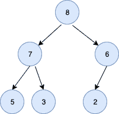

# 堆在戈朗

> 原文：<https://golangbyexample.com/heap-in-golang>

# **简介**

堆是一个完整的二叉树。一个完整的二叉树是一个除了最后一层之外所有层都满了的二叉树。堆有两种类型:

*   **MinHeap**:MaxHeap 是一个完整的二叉树，其中父节点的值大于或等于其左右子节点的值。

*   **MaxHeap**:MaxHeap 是一个完整的二叉树，其中父节点的值大于或等于其左右子节点的值。

下面是一个 minheap 的代表。请注意，父节点总是小于或等于子节点

<figure class="wp-block-image size-large"></figure>

下面是 maxheap 的表示。请注意，父节点总是大于或等于子节点

<figure class="wp-block-image size-large"></figure>

让我们在这篇文章中看看 GO 中 minheap 的实现。

MaxHeap 实现可以在链接–[https://golangbyexample.com/maxheap-in-golang/](https://golangbyexample.com/maxheap-in-golang/)找到

MinHeap 完整描述可在链接–[https://golangbyexample.com/minheap-in-golang/](https://golangbyexample.com/minheap-in-golang/)找到

# **实施闵海普**

```go
package main

import "fmt"

type minheap struct {
    heapArray []int
    size      int
    maxsize   int
}

func newMinHeap(maxsize int) *minheap {
    minheap := &minheap{
        heapArray: []int{},
        size:      0,
        maxsize:   maxsize,
    }
    return minheap
}

func (m *minheap) leaf(index int) bool {
    if index >= (m.size/2) && index <= m.size {
        return true
    }
    return false
}

func (m *minheap) parent(index int) int {
    return (index - 1) / 2
}

func (m *minheap) leftchild(index int) int {
    return 2*index + 1
}

func (m *minheap) rightchild(index int) int {
    return 2*index + 2
}

func (m *minheap) insert(item int) error {
    if m.size >= m.maxsize {
        return fmt.Errorf("Heal is ful")
    }
    m.heapArray = append(m.heapArray, item)
    m.size++
    m.upHeapify(m.size - 1)
    return nil
}

func (m *minheap) swap(first, second int) {
    temp := m.heapArray[first]
    m.heapArray[first] = m.heapArray[second]
    m.heapArray[second] = temp
}

func (m *minheap) upHeapify(index int) {
    for m.heapArray[index] < m.heapArray[m.parent(index)] {
        m.swap(index, m.parent(index))
    }
}

func (m *minheap) downHeapify(current int) {
    if m.leaf(current) {
        return
    }
    smallest := current
    leftChildIndex := m.leftchild(current)
    rightRightIndex := m.rightchild(current)
    //If current is smallest then return
    if leftChildIndex < m.size && m.heapArray[leftChildIndex] < m.heapArray[smallest] {
        smallest = leftChildIndex
    }
    if rightRightIndex < m.size && m.heapArray[rightRightIndex] < m.heapArray[smallest] {
        smallest = rightRightIndex
    }
    if smallest != current {
        m.swap(current, smallest)
        m.downHeapify(smallest)
    }
    return
}
func (m *minheap) buildMinHeap() {
    for index := ((m.size / 2) - 1); index >= 0; index-- {
        m.downHeapify(index)
    }
}

func (m *minheap) remove() int {
    top := m.heapArray[0]
    m.heapArray[0] = m.heapArray[m.size-1]
    m.heapArray = m.heapArray[:(m.size)-1]
    m.size--
    m.downHeapify(0)
    return top
}

func main() {
    inputArray := []int{6, 5, 3, 7, 2, 8}
    minHeap := newMinHeap(len(inputArray))
    for i := 0; i < len(inputArray); i++ {
        minHeap.insert(inputArray[i])
    }
    minHeap.buildMinHeap()
    for i := 0; i < len(inputArray); i++ {
        fmt.Println(minHeap.remove())
    }
    fmt.Scanln()
}
```

**输出:**

```go
2
3
5
6
7
8
```