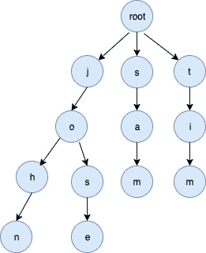

# TRIE 实现方式

> 原文：<https://golangbyexample.com/trie-implementation-in-go/>

# **概述**

trie 是一种用于高效信息检索的数据结构。这是一种特殊的树，其中从根到特定节点的路径可以定义存储在该树中的单词。根据使用情况，可以为整个 ASCII 码、字母、数字建立一个 trie。例如，下面是支持小写字母的 Trie 数据结构的属性

*   每个节点有 26 个子节点。每个子节点本身就是一个 trie 节点，并且有 26 个子节点。

*   每个节点都位于其父节点子节点数组的索引处，并代表一个 ASCII 字符。例如，对于一个特定的节点，第一个非零子节点表示存在字符“a”，第二个非零子节点表示存在“b”等等。索引中没有孩子意味着没有价值

*   每个节点还有一个布尔字段，指示该节点是否是单词的结尾

*   根节点是起始节点，它有 26 个子节点。根与空值相关联

对于关键词[“山姆”、“约翰”、“蒂姆”、“何塞”]的例子，将在下面创建三个



# **全工作码**

```go
package main

import "fmt"

const (
   //ALBHABET_SIZE total characters in english alphabet
    ALBHABET_SIZE = 26
)

type trieNode struct {
    childrens [ALBHABET_SIZE]*trieNode
    isWordEnd bool
}

type trie struct {
    root *trieNode
}

func initTrie() *trie {
    return &trie{
        root: &trieNode{},
    }
}

func (t *trie) insert(word string) {
    wordLength := len(word)
    current := t.root
    for i := 0; i < wordLength; i++ {
        index := word[i] - 'a'
        if current.childrens[index] == nil {
            current.childrens[index] = &trieNode{}
        }
        current = current.childrens[index]
    }
    current.isWordEnd = true
}

func (t *trie) find(word string) bool {
    wordLength := len(word)
    current := t.root
    for i := 0; i < wordLength; i++ {
        index := word[i] - 'a'
        if current.childrens[index] == nil {
            return false
        }
        current = current.childrens[index]
    }
    if current.isWordEnd {
        return true
    }
    return false
}

func main() {
    trie := initTrie()
    words := []string{"sam", "john", "tim", "jose", "rose",
        "cat", "dog", "dogg", "roses"}
    for i := 0; i < len(words); i++ {
        trie.insert(words[i])
    }
    wordsToFind := []string{"sam", "john", "tim", "jose", "rose",
        "cat", "dog", "dogg", "roses", "rosess", "ans", "san"}
    for i := 0; i < len(wordsToFind); i++ {
        found := trie.find(wordsToFind[i])
        if found {
            fmt.Printf("Word \"%s\" found in trie\n", wordsToFind[i])
        } else {
            fmt.Printf("Word \"%s\" not found in trie\n", wordsToFind[i])
        }
    }
}
```

**输出:**

```go
Word "sam" found in trie
Word "john" found in trie
Word "tim" found in trie
Word "jose" found in trie
Word "rose" found in trie
Word "cat" found in trie
Word "dog" found in trie
Word "dogg" found in trie
Word "roses" found in trie
Word "rosess" not found in trie
Word "ans" not found in trie
Word "san" not found in trie
```