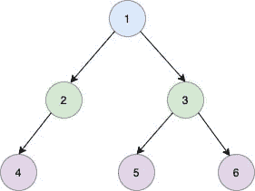

# 从后序和中序构造二叉树

> 原文：<https://golangbyexample.com/binary-tree-postorder-inorder-golang/>

## **概述**

给出了两个数组，表示二叉树的后序和有序遍历。目标是从它们构建一个二叉树

示例:

考虑树下



树的后序遍历将是

```go
[1,2,4,3,5,6]
```

为了遍历树

```go
[4,2,1,5,3,6]
```

将给出后序和有序数组，我们必须从有序和后序重新构建树。以下是策略

*   我们将使用三个索引，即数组的开始、数组的结束和当前索引

*   后缀中的最后一个索引将是根。

*   我们将在一个有序数组中找到索引，它的值与后置数组中最后一个索引的值相匹配。让我们把这个索引叫做根索引

*   有序数组中根索引左侧的所有值都将在左子树中

*   有序数组中根索引右侧的所有值都将在右子树中

*   然后，我们可以对右子树和左子树使用相同的策略进行递归。

伪造

*   后序遍历中的最后一个索引是根，即值`1`

*   值`1`位于有序遍历中的**第二个**索引处。因此根索引是`2`

*   在有序遍历中，根索引的左边部分是**【4，2】**，它是左边子树的一部分

*   在有序遍历中，根索引的右侧是**【5，3，6】**，它是右子树的一部分

*   我们可以先递归右子树，然后递归左子树

## **程序**

下面是同样的程序

```go
package main

import (
	"fmt"
)

type TreeNode struct {
	Val   int
	Left  *TreeNode
	Right *TreeNode
}

func buildTree(inorder []int, postorder []int) *TreeNode {
	lenTree := len(inorder)

	index := lenTree - 1
	return buildTreeUtil(inorder, postorder, &index, 0, lenTree-1)
}

func buildTreeUtil(inorder []int, postorder []int, index *int, low, high int) *TreeNode {
	if low > high {
		return nil
	}
	if low == high {
		currentIndexValue := postorder[*index]
		(*index)--
		return &TreeNode{Val: currentIndexValue}
	}

	currentIndexValue := postorder[*index]
	(*index)--

	root := &TreeNode{Val: currentIndexValue}

	mid := 0
	for i := low; i <= high; i++ {
		if inorder[i] == currentIndexValue {
			mid = i
		}
	}

	root.Right = buildTreeUtil(inorder, postorder, index, mid+1, high)
	root.Left = buildTreeUtil(inorder, postorder, index, low, mid-1)
	return root

}

func main() {
	inorder := []int{4, 2, 1, 5, 3, 6}
	postorder := []int{4, 2, 5, 6, 3, 1}

	root := buildTree(inorder, postorder)
	fmt.Printf("root: %d\n", root.Val)
	fmt.Printf("root.Left: %d\n", root.Left.Val)
	fmt.Printf("root.Left.Left: %d\n", root.Left.Left.Val)
	fmt.Printf("root.Right: %d\n", root.Right.Val)
	fmt.Printf("root.Right.Left: %d\n", root.Right.Left.Val)
	fmt.Printf("root.Right.Right: %d\n", root.Right.Right.Val)
} 
```

**输出**

```go
root: 1
root.Left: 2
root.Left.Left: 4
root.Right: 3
root.Right.Left: 5
root.Right.Right: 6
```

**注意:**查看我们的 Golang 高级教程。本系列中的教程是详尽的，我们试图用例子来涵盖所有的概念。本教程是为那些希望获得专业知识并对 golang 有扎实了解的人准备的- [Golang 进阶教程](https://golangbyexample.com/golang-comprehensive-tutorial/)

如果你有兴趣了解如何在 Golang 中实现所有的设计模式。如果是，那么这个帖子是给你的- [所有设计模式 Golang](https://golangbyexample.com/all-design-patterns-golang/)